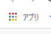
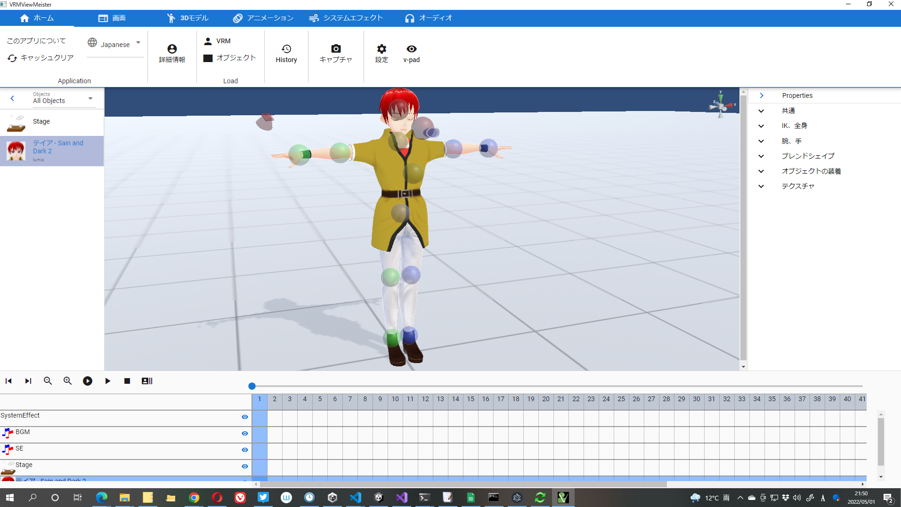
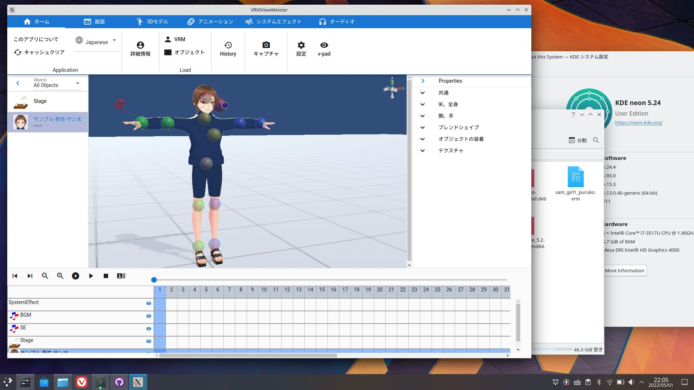

##################
How to install
##################

difference
===============

The differences between the web app version and the PC version are as follows.

.. csv-table::
    
    Item, Web application version, PC version
    Installation, optional (according to PWA specifications), according to the method of each OS
    Internet connection, required, not required
    Operating speed, normal, slightly faster
    Operation in abnormal conditions, operation continues in the event of errors, depending on the OS there is a possibility that the entire application will crash in the event of an error.
    Memory usage, high, low to medium
    Key operation, browser interference, no interference
    File operation, heavily dependent on browser, support and stability for each OS
    Drawing performance, WebGL is low, WebGL is low
    update,automatic,need to reinstall

Web application version
=============================

URL
-----

https://vrmviewmeister.azurewebsites.net

|

.. index:: How to install (web app)

install
--------------------------------

When you access it, an icon like this will be displayed at the right end of your browser's URL bar. Click the leftmost icon to proceed with the installation.

For Edge, you can also install from "..." -> "Apps".

.. image:: ../img/install02.png

.. |logo| image:: ../img/install03.png

|logo| When the installation is complete, it will be displayed with a dedicated icon like this in the menu list of Windows, macOS, and Linux.

|

.. note::
    * What is installation even if you just open the website in the browser?

    | Installed just by opening it in a browser? I think there are some people who think that. This application uses a technology called PWA (Progressive Wab App), which allows you to use the website separately from the browser like a native PC application.
    | By installing this app, you can completely separate it from Chrome or Edge and use it even if the browser is not running.
    | Because this application uses Unity functions, it may be heavy depending on the environment. By installing it, you can prevent Chrome, Edge, etc. that you normally use for browsing websites from becoming heavy. Please install it and use it.

.. warning::
    The web app version does not completely release the used memory even if it is reloaded. Free the memory by closing this application completely. Please be careful when using it for a long time.

app update
---------------------------------------

The web app version updates automatically. When there is an update, the following message will be displayed on the upper right of the screen.

.. image:: ../img/install06.png

After this, a reload will refresh the app.

|

.. index:: uninstall (web app)

Uninstall
-------------------------------------

You can remove this application from your browser by uninstalling it. You can also delete the data used by this application.

Here, we will use Chrome and Edge as examples.

For Chrome
^^^^^^^^^^^^^^^^^^

|uninst01| Click "Apps" in the bookmark bar.

.. image:: ../img/uninstall02.png
    :scale: 60
    :align: left

Search for this app, right-click it, and click "Remove from Chrome".

The message below will be displayed, so please check the checkbox if necessary and press the "Delete" button.

.. image:: ../img/uninstall03.png
    :scale: 70%

For Edge
^^^^^^^^^^^^^^^

.. |uninst04| image:: ../img/uninstall04.png

|uninst04| Click "..." -> "Apps" and then "Manage apps".

Find this app and click the "x" button on the far right.

.. image:: ../img/uninstall05.png

A message will be displayed in the same way as Chrome, so check the checkbox if necessary and press the "Delete" button.

|

.. index:: 
    PC version (each OS version)

PC version (each OS version)
========================================

install
--------------------------------

Since the PC version (each OS version) is a normal PC application, use it according to the installation and update method of each OS.

Windows
^^^^^^^^^^^^^^^

Windows procedure.

This is the procedure for Windows.

1. After downloading the 7z file, unzip it in a suitable location.

.. image:: ../img/install04.png

2. Double-click ``vrmviewmeister.exe`` inside to start it.

.. image:: ../img/install05.png

Start like this.

|

macOS
^^^^^^^^^^^
..
    .. caution::
        | 今後パッケージ化に成功したら正式な手順を掲載します。以下はソースからビルドして起動する場合です。
        | 必ずウェブアプリ版や他OS版を試して当方を信頼できる、と判断した場合のみソースからビルド・実行をしてください。
        | この場合、ご利用端末で問題が発生した場合に責任は保証できませんのでご了承ください。

    1. Node.jsやPythonをインストールします。
    #. githubから ``git clone`` をしてリポジトリをダウンロードします。
    #. README.mdに記載の通り、次のコマンドを順次実行していきます。

    .. code-block:: bash

        $ npm install
        $ npm run wpbuild
        $ npm run swbuild
        $ npm run compile:electron
        $ npm run electron

    ※パッケージをビルドして実行する場合

    .. code-block:: bash

        $ npm run build:mac

        ※後はFinder上で dist/ 内の vrmviewmeisterを実行します。

1. Double-click the downloaded ``vrmviewmeister-[version number].dmg``.
2. Drag the ``vrmviewmeister`` inside to your Applications folder.
3. Please start from search or menu.

.. image:: ../img/install_mac.jpg

|

Linux
^^^^^^^^^^^

For Linux, please use a distribution that supports the AppImage format.

1. Double-click the downloaded ``vrmviewmeister-[version number].AppImage`` to start it.

.. warning::
    Due to the specifications of Unity and each library, VRM, FBX, etc. cannot be read from the terminal in Linux in a virtual environment. Please be sure to check with the actual machine.

|

.. index:: Uninstall (PC version)

Uninstall
------------------------------------------

I am not using the registry. Please delete the entire folder when uninstalling.

In addition, personal data is stored in the following folders, so please delete them together.

.. code-block:: shell

    Windows:
    C:\Users\[username]\AppData\Roaming\vrmviewmeister

    macOS:
    ~/Library/Application Support/vrmviewmeister

    Linux:
    ~/.config/vrmviewmeister

.. index:: 
    Switch language
    Change language
    Locale

Switch language
=========================

You can switch languages from the ``Home`` tab of the ribbon bar.

Select the language you want to switch to. The language is switched immediately except for some UI.

.. raw:: latex

   \cleardoublepage

