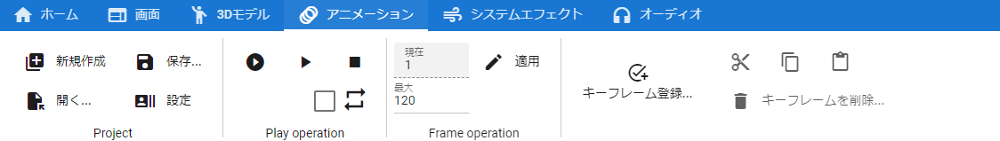

.. index:: animation tab (ribbon bar)

#####################################
Animation tab
#####################################

|

There are buttons for functions related to animation.

**In Project**

:Create New:
    Create a new animation project.
:open:
    Open an existing animation project file.
:keep:
    Save the current animation project to a file.
:setting:
    Open the animation project settings screen.

.. note::
    * You can save with a name and save or overwrite.

**In the Play operation**

:Play from beginning:
    Play the animation from the first frame.
:Play/pause from the middle:
    Play or pause animation.
:Stop:
    Stop the animation completely.
:loop:
    Toggles loop playback on/off.

..
    :default interval:
        Specifies the number of seconds between frames in the current animation project. By default, the calculation result of ``FPS / 6000.0`` is set.
    
* Moved ``default interval`` to Project setting.

**In Frame operation**

:the current:
    This is the currently selected frame number. If you change it, it will move to that position and apply the pose.
:maximum:
    Change the maximum number of frames. Note that if you decrease it, the key at that position will be deleted.
:Application:
    Actually apply the modified maximum number of frames.

**In Key operation**

:register keyframes...:
    **ver 2.1.0 or later**
    Displays the keyframe registration window.
    The window that appears can be opened by right-clicking anywhere within a tab on the ribbon bar.
    
    
:Cut/Copy/Paste:
    Manipulate keyframes of the current object.
:delete keyframe...:
    Deletes keyframes on the currently selected timeline. Please note that it is not the selected 3D object.

    :What can be deleted:
        * the keyframe itself
        * properties only

    | By deleting only the properties, the keyframe will be only the contents of common properties such as movement and rotation.
    | If only the properties are deleted, the keyframes themselves remain undeleted. Choose ``Remove keyframe`` to completely remove it from the timeline.