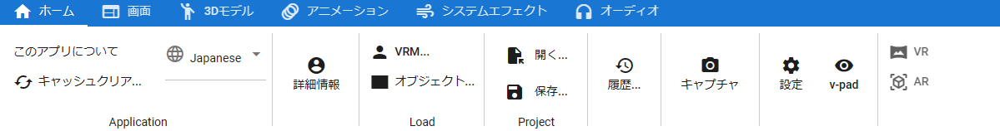

.. index:: home tab (ribbon bar)

#####################################
Home tab
#####################################

    

|

Home has buttons for frequently used functions.

Application
     :About this app:
        Displays the logo of this application.
     :clear cache:
        Deletes file open history and temporary files all at once.

        .. image:: ../img/screen_ribbon_home_clearcache.png

        |

        ================================= ==================
        Organize WebGL operations         Check the operations and clear unnecessary caches when WebGL stops working when you operate the HTML UI.
        Clearing the cache of the app     Delete all the data that is only temporarily stored in the app.
        Delete app settings               Deletes all the settings shown in the app settings and restores the default state.
        ================================= ==================
        
     :language choice:
        Switch the UI language of this application. Some UI will be reflected after the next startup.

:Detailed information:
    Displays information for the selected VRM.

Load
    :VRM:
        Open and load VRM.
    :object:
        Open and load FBX, OBJ, etc.

Project
    :open:
        Open an existing animation project file.
    :keep:
        Save the current animation project to a file. Equivalent to **Save** in this tab.

:history:
    Displays a dialog to open each object (VRM, OtherObject, Image) once opened.

:capture:
    Take a screenshot of the current WebGL screen and save it.

:setting:
    Display the setting screen of this application.
:v-pad:
    Displays the operation pad of the main camera.