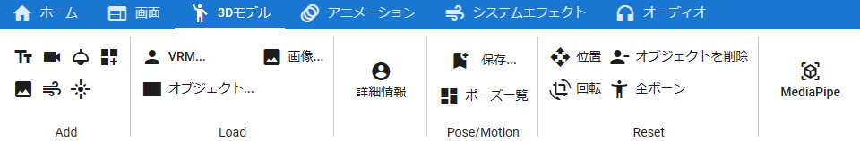

.. index:: model tab (ribbon bar)

#####################################
Model tab
#####################################

|

There are buttons for functions related to 3D models.

**In Add (4 rows above, 3 rows below)**

:text:
    Add text to the WebGL screen.
:camera:
    Add a camera to your WebGL screen. This will be the sub camera.
:Spotlight:
    Add a spotlight to your WebGL screen.
:Basic shape:
    Add blank objects such as spheres, planes, and rectangles.
:UI image:
    Add image as 2D to WebGL screen. This is not a 3D object.
:effect:
    Add effects to your WebGL screen.
:Point light:
    Adds a light that illuminates a certain area of space on the WebGL screen.

**In Load**

:VRM:
    Load the VRoid (VRM) and load it.
:object:
    Open and load FBX, OBJ, etc.
:Image:
    Load the image as a 3D object. After loading, it can be operated in the same way as FBX or Obj.
:Detailed information:
    Displays information for the selected VRM. Doesn't work outside VRM.

**In Pose**

:Save pose:
    For VRM only, saves the current pose of the currently selected VRM to a pose file.
:Pose list:
    Displays a list of saved poses with thumbnails.

**In the Reset operation**

:reset position:
    Resets the position of the selected 3D object to its initial position.
:reset rotation:
    Resets the rotation of the selected 3D object to its initial angle.
:delete model:
    Delete the selected 3D object from the app.
:Reset all bones:
    Resets all bones and IK positions and rotations of the whole body of the selected VRM. (return to T pose)

**others**

:MediaPipe:
    Use the pose tracking function by AI.