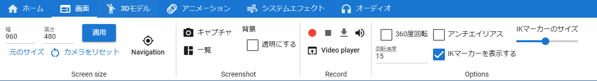

.. index:: screen tabs (ribbon bar)

#####################################
Screen tab
#####################################

|

There are buttons for screen-related functions.

**within screen size**

:Screen size:
    Specify the width and height of the WebGL screen freely.
:Application:
    Reflects the size you entered.
:original size:
    Resize the WebGL screen back to match the current app size.
:reset camera:
    Restore the default position of the main camera. (Shortcut: R key)
:Navigation:
    Displays a small navigation window.

**In Screenshot**

:capture:
    Take a screenshot of the current WebGL screen and save it.
:list:
    Displays a window for displaying and managing screenshots taken.
:Transparent background:
    Makes the background part of the WebGL screen transparent when taking screenshots.

**In Record movie**

:Recording:
    Start recording the WebGL screen. All operations and animations are recorded until you stop.
:Stop:
    Stop recording.
:Download Video:
    Download the recorded content. The format is webm format.
:Enable/mute audio:
    Mute or re-enable audio for recorded video.
:Video player:
    Opens the built-in video player in a separate window.

**in Options**

:360 degree rotation:
    Rotate the camera 360 degrees around the currently selected object.
:Rotational speed:
    Adjust the speed of rotation.
:antialiasing:
    Applies anti-aliasing to WebGL screens.
:Show IK markers:
    Toggles the display of IK markers when manipulating each object.
:IK marker size:
    Change the size of the IK marker. (0.01 to 0.2)