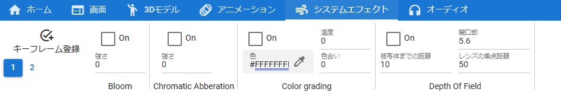
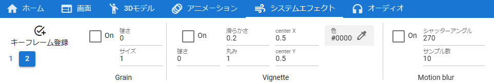

.. index:: System Effects tab (ribbon bar)

#####################################
System effect tab
#####################################

.. csv-table::

    |syseff1|
    |syseff2|

|

There are buttons for functions related to system effects (screen effects).

A system effect is Post-processing in Unity terms. Not all of Unity's Post-processing can be used.

:page number:
    3 to 4 of each effect are displayed per page.

:On:
    Enables/disables each effect. The available effects are:

::
    
    Bloom, Chromatic Abberation, Color grading, Depth of field, Grain, Vignette, Motion blur

.. hint::
    Starting with ``ver 2.1.0`` , you can also use the keyframe registration window displayed by right-clicking on other objects.

    However, **only system effects can be registered** while the system effects tab is open. 

    Basically, it is easier to understand and more convenient to use the ``Register keyframe`` button in the tab, but please use it properly.