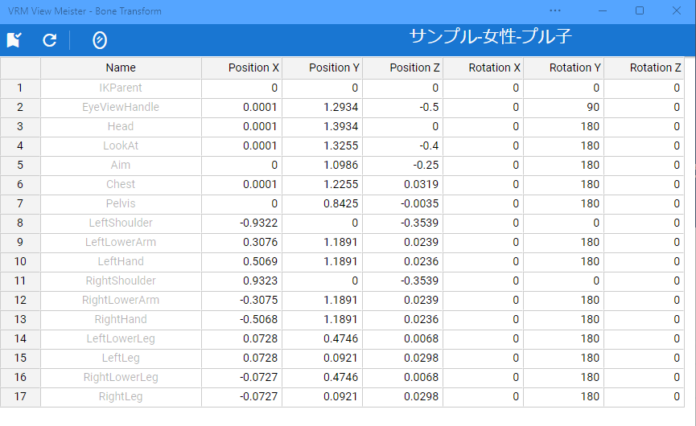

.. index:: Change the position of the IK marker (screen composition)

#####################################
Repositioning of IK markers
#####################################

This function is used for VRoid/VRM. You can directly specify the position and rotation of the body parts of the model used in this application. A new window will open. It is a separate window from the app.

**Top:**

:apply pose:
    Apply a pose with the values specified in the spreadsheet below.
:Reload:
    Reload the current pose information.
:Reverse pose:
    Flip the values of the current pose left to right

**beneath:**

:Spreadsheet:
    Specify the Position and Rotation values for each part of the body.

.. note::
    * You can move and rotate the VRoid/VRM directly while this window is displayed, but due to the specifications, it will not be immediately reflected in the spreadsheet of this window. By pressing the reload button, you can get the position and rotation information immediately.

    * Automatically reloads when you change the object selection, or when you change the timeline keyframe selection.

    * If you select other than VRM, the spreadsheet will not be available.