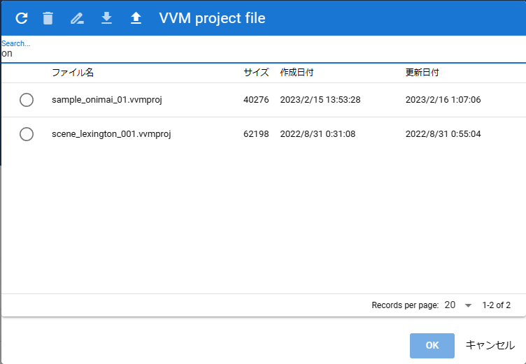

.. index:: Internal storage dialog (screen configuration)

#####################################
Internal storage dialog
#####################################

|

This is the screen for opening animation projects saved inside the app or files that have been opened once.

|

**Toolbar:**

:Reload:
    Reload the list.
:delete:
    Delete the selected file (from within the app).
:File type name:
    The name of the currently displayed file type.

.. note::
    * The following are animation projects only.
    
    :rename:
        Rename the selected project file.
    :download:
        Download and save the selected animation project.
    :Open from file:
        Open the animation project file from your terminal.

:search box:
    Input field for incremental search of each file.

:list:
    A list that displays the file name, size, creation date, and update date.