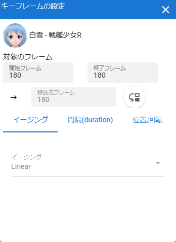
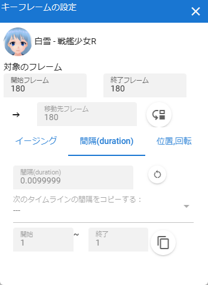
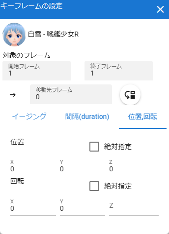

.. index:: keyframe settings (screen configuration)

#####################################
Setting keyframes
#####################################

This is a setting window related to keyframes in the timeline. This window is another window.

Double-click a registered keyframe to open it.

.. csv-table::

    |keyframe1|, |keyframe2|, |keyframe3|

|

:role name:
    Displays the name of the role of the timeline currently being edited.

target frame
    :start frame, end frame:
        Displays the number of the keyframe currently being edited. When selected from the timeline, the same frame number is set for both, but you can change it to any range.

        For example, if the start frame is set to 10 and the end frame is set to 15, the registered keyframes within the range of 10 to 15 will be the target of the operation.
    
    :Destination frame:
        If you change this, the keyframe setting will move to that frame position. This corresponds to the start frame after moving.

    :Move button:
        Confirms the movement of the frame position. If you enter a frame position that already has a keyframe registered, the button cannot be pressed.

easing tab
    :Easing:
        Select the easing up to the keyframe you are editing.

duration tab
    :interval:
        Manually specify the interval (seconds) from the previous registered keyframe to the keyframe being edited. Basically it is calculated automatically, but if you dare to change it, you can change it here.

    :reset interval:
        Resets the interval (in seconds) before the keyframe being edited to the automatically calculated value.

    :copy the next timeline interval:
        By selecting the source timeline (role) and specifying the start and end of the keyframes registered on that timeline, you can copy the total duration value of that range.

        * **In order to reflect after copying, it is necessary to further operate the input box for duration** . 

position, rotation tab
    :Position X, Y, Z:
        coordinates of each.

    :Rotation X, Y, Z:
        The rotation angle of each axis. Unlike the same item in the property list, here it is from -180 to +180 degrees.