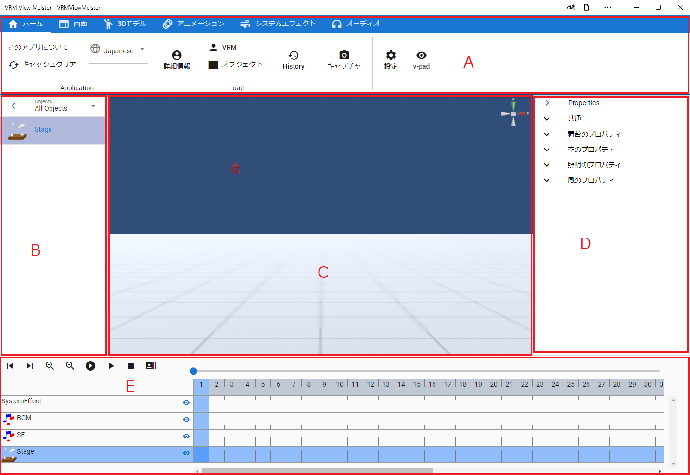

.. index:: Main screen (screen composition)

###############
Main screen
###############

|

:A Ribbon bar (tab):
    A menu that calls each function of the app.
:B Object list:
    A list of loaded VRMs, FBXs, and objects.
:C WebGL:
    The screen where VRM etc. is actually displayed. A format called WebGL. Resizable.
:D List of properties:
    A list of selected VRMs and detailed property changes for each object.
:E Timeline:
     animation timeline. Registered keyframes are displayed here.

.. note::
    * The WebGL screen displays the center point of the main camera depending on the settings.
    * B and D can be minimized with the button on the right edge of each. (WebGL in C scales accordingly)

App windows and subwindows
========================================

This application consists of a window showing this main screen and several sub-windows described later.

.. csv-table::
    :header-rows: 1

    Window name, Window type (web application version), Window type (each OS version)
    main window, browser tab or separate window, separate window
    screenshot, new window, new window
    Pose list, another window, another window
    Batch change of IK markers, another window, another window
    gravity settings, in-app window, in-app window
    pose tracking, separate window, separate window
    video player, separate window, separate window
    keyframe setting, separate window, separate window
    internal storage dialog, in-app window, in-app window
    navigation, in-app window, in-app window

In the case of a separate window, closing the main window (or tab) will also close all sub-windows that are open at that time.