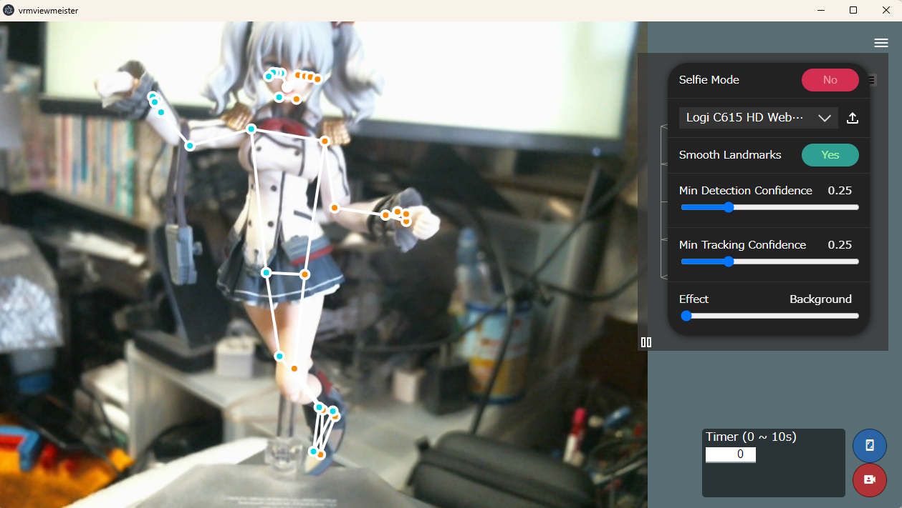

.. index:: 
    Pose tracking screen (screen configuration)
    MediaPipe (screen composition)

#####################################
Pose tracking screen
#####################################

|

This is a real-time pose acquisition screen using Google's MediaPipe library. This window is a separate window from the app.

**Upper Right:**

Menu of each function for pose detection.

:Selfie Mode:
    The image is reversed.
:combo box:
    Select a camera.
    
    Click the **icon next to the box** to open the image file.
:Smooth Landmarks:
    Adjust the precision of the overall preview on the top right.
:Min Detection Confidence:
    Increases accuracy of pose detection.
:Min Tracking Confidence:
    Increase tracking accuracy.
:Effect:
    (see MediaPipe site)

**Upper right (background):**

Hiding the menu allows you to see a preview of the tracking results in the background.

:full preview:
    This is a preview of the tracking results. You can check any direction by dragging. You can lock the rotation of the preview with the || button on the bottom left.

**bottom right:**

:timer:
    After this specified number of seconds, the picture will be taken automatically.
:Save pose:
    The detected pose at the moment this button is pressed is saved in data. If the number of seconds in the timer is non-zero, the timer fires.

.. note::
    The menu panel can be hidden with the = button.