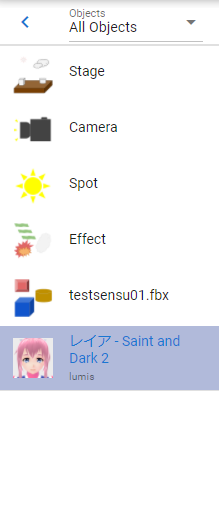
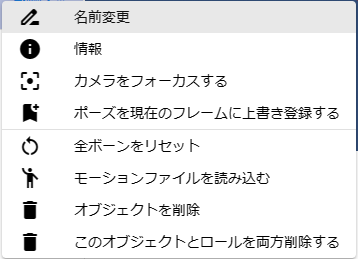

.. index:: Object list (screen composition)

#####################################
Object list
#####################################

This is the list on the left of the WebGL screen. Each loaded object is grouped here.

**Top:**

:Arrow buttons:
    Press to collapse the object list and make it thinner.
:combo box:
    Select an object type. The list below shows only objects of that type.

**beneath:**

:list:
    Object list. The following types are displayed here:

``VRM``, ``other 3D object``, ``camera``, ``effect``, ``light``, ``image``, ``text``, ``UI image`` , ``stage``

..note::
    * System effects and audio are not shown here.
    * The timelines of roles to which the selected object is assigned are also automatically selected.
    * Long names are truncated. Instead, the full name is displayed as a tooltip when hovered over with the mouse cursor.

|

**Right click menu**

By right-clicking in the object list, you can perform individual operations on that object.

|

:rename:
    Change the display name of an object.
:information:
    Displays the information screen only for VRoid/VRM.
:focus the camera:
    Move the main camera so that this object is centered on the screen.
:Register the pose to the current frame:
    Use in animation projects. Registers the current pose to the current keyframe.
:Reset all bones:
    Reset pose back to T pose (default).
:Load motion file:
    It is the same as ``Read motion file`` in the project settings. Load and apply a motion file to the currently selected object.
:delete model:
    Remove the object from the app.
:Delete both this model and role:
    Delete an object and its associated role from the app.