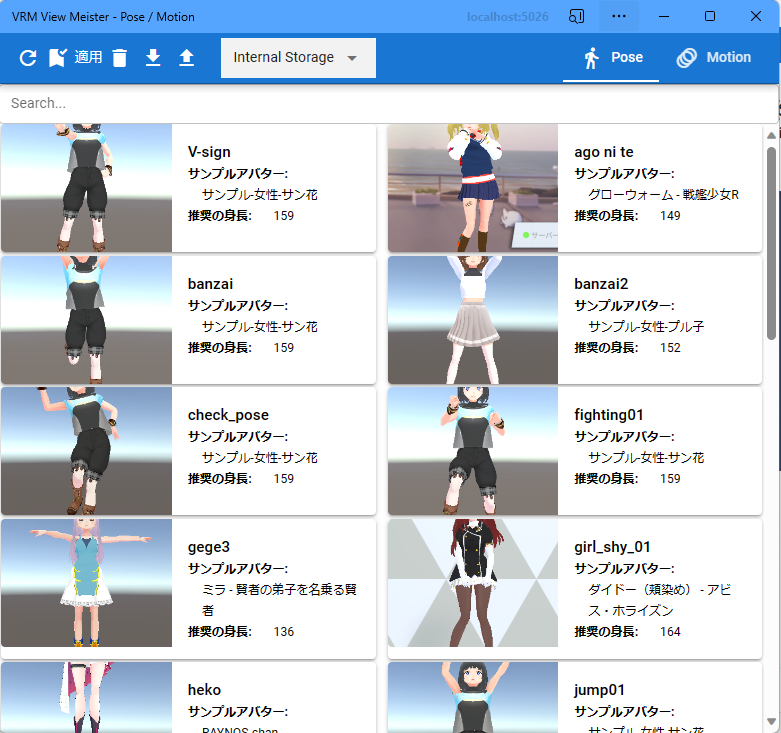

.. index:: List of poses (screen composition)

#####################################
Pose list
#####################################

|

The pose list can save a single VRoid/VRM pose. A new window will open. It is a separate window from the app.

|

**Top:**

:Reload:
    Reload the pose list.
:apply pose:
    Reflect the currently selected pose to the currently selected VRoid/VRM.
:delete pose:
    Delete the currently selected pose.
:Download as file:
    Download the currently selected pose to a file.
:Open from file:
    Open the pose file from your terminal.

**beneath:**

:Pose list:
    Display saved poses with thumbnails. The pose name and avatar (VRM) name at the time of saving are displayed together next to the thumbnail.

|

.. hint::
    Depending on the size of the window, it will be displayed in 2 columns or 3 columns.