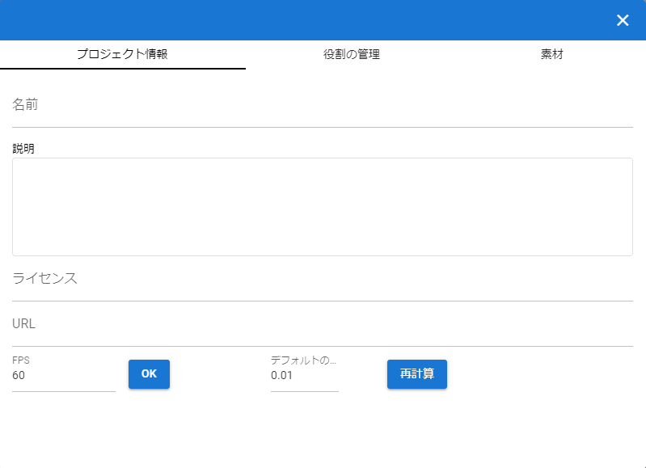
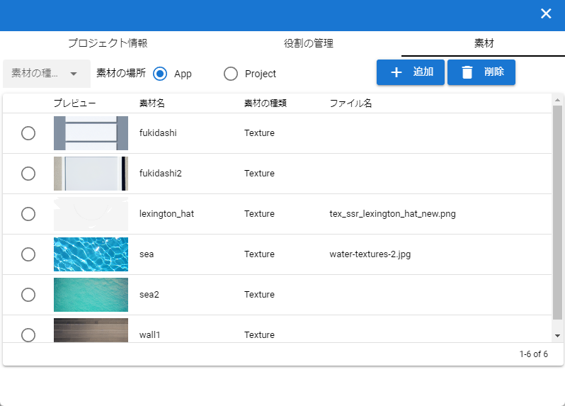

.. index:: Project settings (screen configuration)

##########################
Project setting screen
##########################

This is the screen for setting the role name of each object in the animation and assigning each object to the read role. (Animation will be discussed later)

Project information
=======================

This is a tab where you can make a note of the outline of the project file.

|

:name:
    Animation project name
:explanation:
    Detailed description of the animation project
:URL:
    URL you want to specify
:license:
    Animation project license terms (if needed)
:FPS:
    Sets the animation FPS.

Role management
==================

This tab is used to select and manage roles (roles/timelines) within an animation project and casts (objects) assigned to them.

|

:role:
    Enter the role of the object (name for identification within the animation project)
:kinds:
    role type
:cast:
    Select objects to assign to role

material
===============

This tab manages materials such as textures in the app.

|

:Material type:
    Select from Texture etc.
:Material location:
    Switch between in-app or in-project

     | ``App`` - in the app
     | ``Project`` - in the current animation project

:addition:
     add material

:delete:
    Delete the material selected in the list

:list:
     Material preview, material name, material type, file name

.. note::
     Rows with no images loaded in the list look like this:

     .. image:: ../img/screen_project5.png
        :align: center
    
     Press the ``No Preview`` button to load the image.

Add material
---------------

This is a dedicated pop-up window for adding materials.

.. image:: ../img/screen_project6.png
    :align: center

|

:Material label:
    Specifies the name used to refer to the texture in the application

:Material file button:
    Select the image file etc. you want to use as a texture from the terminal