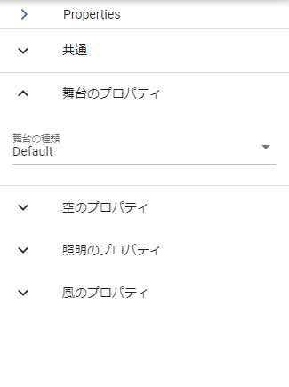

.. index:: property list (screen configuration)

#####################################
Property list
#####################################

This is the list on the right side of the WebGL screen. Setting items for each loaded object are listed.

|

:Arrow buttons:
    When pressed, the property list can be collapsed and narrowed.

**Each accordion panel:**

Different properties are displayed depending on the object type.