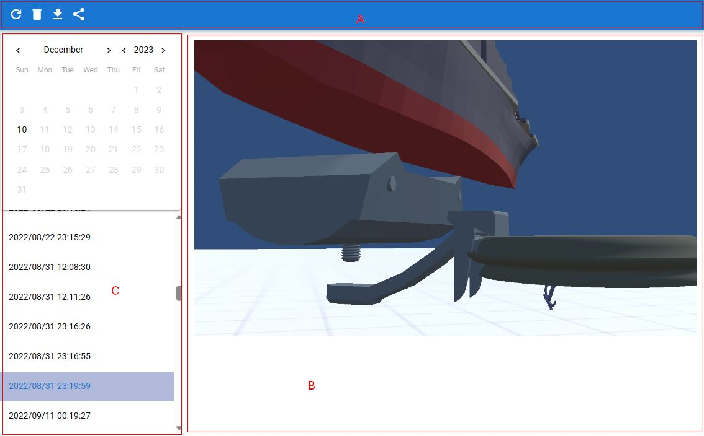

.. index:: Screenshot (screen configuration)

#####################################
screenshot
#####################################

|

The screenshot list is a window for checking, downloading, and deleting currently saved screenshots. It is a separate window from the app.

:A Toolbar:
    Delete button, reload button, download button
:B screenshot:
    Actual screenshot. In the case of a browser, you can also right-click and save.
:C Date list:
    * Calendar of the date the screenshot was taken
    * A list of dates the screenshots were taken. Click to view image.