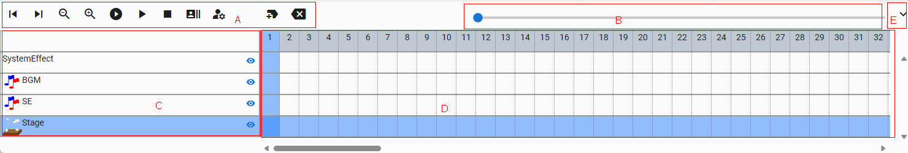

.. index:: timeline (screen configuration)

#####################################
Timeline
#####################################

|

This is the function at the bottom of the WebGL screen. Used in animation.

:A Toolbar:
    From the left: Move back/advance the current position of the frame, reduce/enlarge the display, play from the beginning, play/pause, stop, load the frame, display the keyframe setting window, empty frame at the current position insert, delete current frame position

:B Seek bar:
    Move the current position of the frame to any location.

:C object role name:
    Displayed to identify the timeline.

    Show/Hide button ... Hide the object from the WebGL screen.

:D timeline:
    Displays keyframes for each object. You can switch the frame to operate by pressing the number at the top. The registered keyframes are filled in red. **When registering a child key, the number in the red cell part of the key frame is counted accordingly.**

    Double-click to open the keyframe settings window.

    If you place the mouse cursor over a registered keyframe, you can check the current settings in a popup.

    .. image:: ../img/screen_timeline02.png
        :align: center

|

:E child-key stroke bar:
    From left: child key registration, child key selection box, child key deletion

:F Panel enlargement/reduction button:
    Toggles between expanding and contracting the timeline panel (toolbar only).