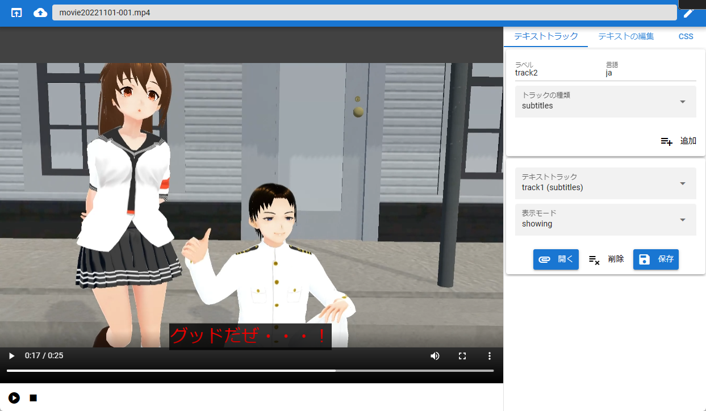

.. index:: video player (screen composition)

#####################################
video player
#####################################

|

It is a dedicated simple video player so that you can play videos only with this application without using a special playback application. It is a separate window from the app.

You can also edit the subtitles or load them and play them with subtitles.

**Top:**

: Open from app:
    Load the video recorded by the recording function of this application.
: open from local:
    Reads videos (common formats such as mp4, webm format, etc.) on your PC.
: Edit Subtitles:
    Displays the edit panel that adds subtitles according to the loaded video.

**beneath:**

:Play: Play from the beginning of the video. or pause.
:Stop: Stop and seek to the beginning of the video.

**Right side:**

:Text Tracks tab: Add and manage subtitle tracks to your videos.
:Edit Text tab: You can edit the subtitles in the selected subtitle track.
:CSS tab: You can edit the CSS applied to the subtitle track.