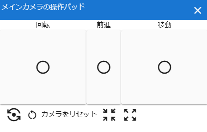
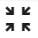
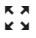

.. index:: v-pad (screen configuration)
.. index:: Control pad of the main camera (screen structure)

#####################################
v-pad (control pad for main camera)
#####################################

A virtual mouse pad that allows you to operate the image of the main camera instead of the mouse. If you swipe (drag with the mouse) up, down, left, or right in the square panel, the WebGL screen will move accordingly. The amount of rotation and movement is determined by the length of operation.

I want to operate with one hand without using the keyboard! I want to use it on my tablet PC! You can also use it in such cases.

:rotate:
    Equivalent to moving the mouse up, down, left, or right while right-clicking.
:Forward:
    Equivalent to moving the mouse wheel.
:move:
    Equivalent to moving the mouse up, down, left, or right while clicking the middle mouse button.

:|sub1| Reset camera Z axis:
    Equivalent to the keyboard ``Q`` key. Initialize the Z-axis rotation of the main camera.

Reset camera:
    Restores the default position of the main camera. (Shortcut: R key)
    
    * This is the same as the button on the screen tab of the ribbon bar.

:|sub2| Reduce the distance between the camera and the center point:
    Equivalent to the ``I`` key on a keyboard. Bring the main camera closer to the center point. When it reaches 0 distance, it will move away.

:|sub3| Increase the distance between the camera and the center point:
    Equivalent to the keyboard ``O`` key. Move the main camera away from the center point. It approaches when it reaches 0 distance.

.. note::
   * Advance panel can only be swiped up and down (drag).
   * You can increase the screen size of the WebGL screen, but this may make it difficult to operate the mouse. In such a case, using this v-pad is convenient because you can finely adjust the display.