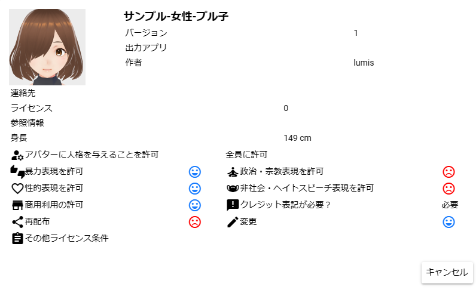

.. index:: VRM information screen (screen configuration)
.. index:: VRM usage conditions confirmation screen

#####################################
VRM information screen
#####################################

|

This is a screen that displays various information such as the terms of use of the VRM to be read. When loading for the first time, the "Conditions of Use Confirmation Screen" will appear, and you can officially load the VRM by pressing the OK button. (Press the Cancel button to abort reading)

| * Height is for calculation purposes only and is not a precise value.
| * Permission and non-permission of terms of use are expressed with pictograms.

|sub1| allow

|sub2| not allowed

.. note::
    * This screen can be displayed at any time for confirmation, even if it is not the first time loading.