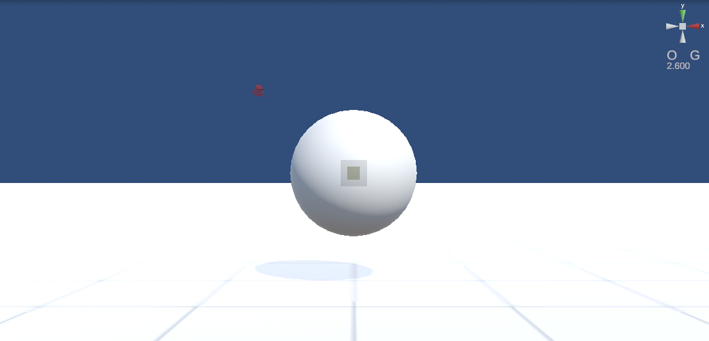

.. index:: WebGL screen (screen composition)

###############
WebGL screen
###############

:top right:
    
    ======= =======
    Top     Change the orientation of the main camera display on the X, Y, and Z axes
    Middle  | Mode of current keyboard interaction (C - Camera, O - Object)
            | Global/local basis when working with objects (G - global, L - local)
    Bottom  Distance between the center point in front of the camera and the selected object
    ======= =======

:whole:
    A screen on which VRMs and other objects are displayed. This is the image of the main camera.

.. index:: How to operate (screen structure)

**Method of operation**

:rotate:
    Move up/down/left/right while right-clicking the mouse or holding down the Ctrl key
:Advance:
    Move the mouse wheel. Forward or backward.
:move:
    Move up, down, left, or right while holding down the middle mouse button or the SPACE key

Browsers with mouse gestures may conflict with operations and may not work properly. Please turn off the mouse gesture function, use the keyboard operation, or use the v-pad described later. Each OS version is not affected.

.. hint::
     See :doc:`../man5/special_operation` for detailed keyboard operation.

|

