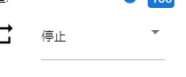

.. index:: Audio

#####################################
Audio
#####################################

Audio is not a 3D object, but as its name suggests, audio. It is played with the Unity standard function, but "ogg" cannot be used due to WebGL restrictions.

.. image:: ../img/screen_ribbon_audio.png
    :align: center

|

For Audio, change the settings in the Audio tab on the top ribbon bar, not in the property list.

1. Load an audio file by pressing the following button:

.. image:: ../img/operation_audio_1.png
    :align: center

|

2. Select the audio name you want to play in the combo box directly below.

.. image:: ../img/operation_audio_2.png
    :align: center

|

3. Configure for preview playback or animation projects.

.. |norange| image:: ../img/operation_audio_3.png

.. csv-table::

    For preview playback, animation registration
    |norange|, |isrange|
    It will play instantly. This operation is not registered in the keyframe. , After selecting "Play" or "Stop", register the keyframe.

4. To register the audio to the animation project, use the ``Register Keyframe`` button in the tab, or right-click in this tab and select the ``Register Keyframe`` button.

.. image:: ../img/screen_ribbon_animation_keyframe2.png
    :align: center

|

.. note::
  * "Register keyframe" displayed when right-clicking in this tab is for audio only. No matter what object you select, it will always target audio only, so be careful.

.. warning::
    * Because the rights of audio files are considered to be particularly strict, please be sure to protect the rights when using music files of third parties.

    The audio loaded in this app will be deleted from the browser when the app is reloaded. Since it is only handled locally and there is no sharing function, only files that the user owns can be used.