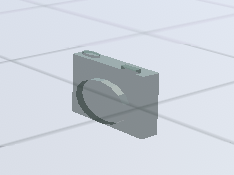
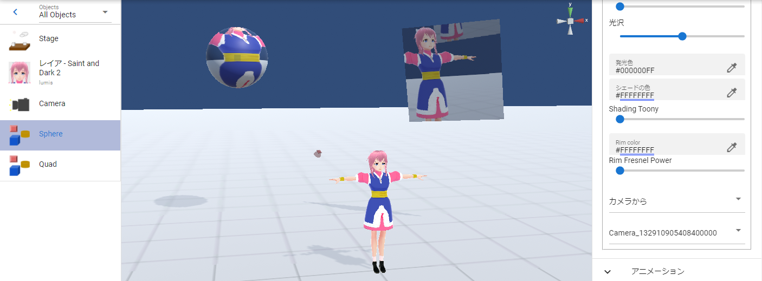

.. index:: Camera

#####################################
Camera
#####################################

The camera object can be added as a sub-camera separately from the main camera, which is the video that is visible from the beginning of the system.

The IK markers look like real cameras to make them easier to distinguish.

.. contents::

The depth, which represents the priority of camera display, is as follows.

.. csv-table::

    system main camera, 10
    camera object, 11-n

|
|

The camera object is always drawn above the system's main camera. There is no limit to the number of additional cameras. (Only one camera can be projected at a time unless a viewport or render texture is used.)

When you preview it, it will switch to the image of that camera. Since it is only meant as a preview, the IK markers seen from the main camera are displayed as they are.

To switch to the video from the camera object in the animation project described later, switch and register at the desired keyframe in the combo box "Camera state (for registration)" immediately above.

.. note::
    * When previewing a keyframe (when a keyframe is selected), the state of the action is reflected so you can check it. (Even if you turn off the video by pressing the preview button at that time, the registration to the keyframe will not change.)

.. index:: render texture

Render texture
--------------------

| Use this when you want to project the image of the camera object through another object.
| After enabling the render texture by ``ON``, continue setting the properties of the OtherObject you wish to project.
| * Please enable the preview as well.

1. In the Camera object, enter the desired size for Render Texture X, Y.
2. Turn on the check box next to it.
3. Click the ``Apply`` button for the Render Texture.
4. Click the Play Preview button.

.. note::
   * Normally, the WebGL screen will change when you preview playback, but if you turn on the render texture, the screen will remain the same.

**OtherObject side**

OtherObject opens the texture settings.

.. image:: ../img/operation_camera_2.png
    :align: left

Select ``From camera`` in the main texture and select the target camera object.

|
|
|

* An example of projecting onto a plane object ``Quad`` and a spherical object ``Sphere``. If you specify the same camera object, you can project to multiple objects at the same time.

|

.. caution::
    Render textures use relatively machine power. Please be careful not to overuse.