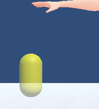

.. index:: Effect

#####################################
Effect
#####################################

Effect allows you to add animated screen effects as objects and set effects that affect other objects.

.. contents::

.. index:: Effect preview

.. image:: ../img/operation_effect_1.png
    :align: center

|

The IK marker is capsule-shaped to distinguish it from others. Displays special effects relative to the position of the IK marker. There is no limit to the number that can be displayed at the same time (but the operation may be slow). Also, effects with sound effects will sound at the same time.

In the animation project, the states such as "play" and "stop" of the effect animation are registered in keyframes.

1. Select a genre.
2. Select an effect name within the genre.
3. Press preview play to see the effect.

.. |preview| image:: ../img/operation_effect_2.png

.. csv-table::

    For preview playback, animation registration
    |preview|, |anireg|
    It will play instantly. This operation is not registered in the keyframe. , After selecting "Play" or "Stop", register the keyframe.

.. caution::
    You cannot play it again until the effect has finished playing.

|

.. index:: Collision property with VRM

Collision properties with VRM
----------------------------------

It is an effect that can be moved by colliding with parts with bones such as VRM hair.

.. image:: ../img/operation_effect_4.png
    :align: center

|

If you check the Use Collision function, the range of collision will be drawn as a translucent sphere. This is for preview purposes.

You can change the range by changing the size of the collision range. The preview sphere changes accordingly.

.. |isrange| image:: ../img/operation_effect_6.png

========= ============
|norange| |isrange|
========= ============

.. |collidertarget| image:: ../img/operation_effect_7.png
.. |colliderdecide| image:: ../img/operation_effect_8.png
.. |colliderdelete| image:: ../img/operation_effect_9.png

:|collidertarget|:
    |
    | Select the VRM you want to collide with.

:|colliderdecide|:
    |
    | Register with the selected VRM. Multiple VRMs can be registered to one Effect.

:|colliderdelete|:
    |
    | If you want to delete the setting, delete it with the rightmost button of the target VRM.

.. index::
    Functional changes according to VRM 1.0 specification (collision property with VRM - Effect)

.. admonition:: Functional changes according to VRM 1.0 specification

    In VRM 1.0, the specifications around SpringBone such as hair and chest have changed significantly.

    In UniVRM 0.x, it seems that collision with colliders was always effective without doing anything, and in this application, when this Effect object collided with VRM, SpringBone moved with appropriate collision intensity.

    However, in VRM 1.0, special settings are required to move SpringBone by body parts other than those set from the beginning. As a result, SpringBone's behavior isn't quite the same as it was in his 0.x days.

.. caution::
    **Enabling the VRM Collision property should be the bare minimum** .

    If you enable this property, set the target VRM, and then move the bones of the body, you can see that the movement of the SpringBone, such as the hair and chest, is **very slow** or * compared to when this property is off. *Minimum movement**.

    Normally, it would be unnatural to have to shake quickly, so unless you want to explicitly move the SpringBone of a specific VRM with this property of the Effect object, **recommend to turn it off**. increase.

    We plan to adjust the function again when the specification of VRM 1.0 changes.