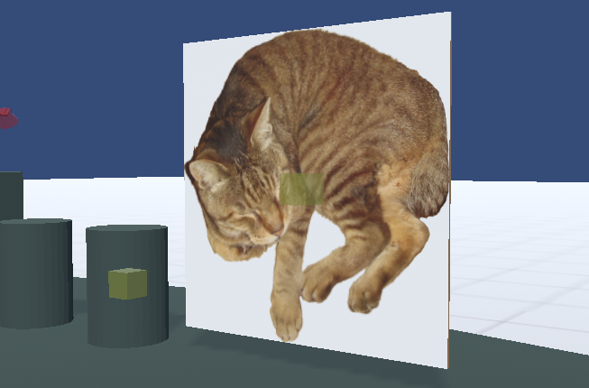

.. index::Image

#####################################
Image
#####################################

Images are basically treated the same as OtherObjects. Photos and illustrations are displayed on the plane as shown.

|

You can freely scale and rotate it, so it can be used for backgrounds.

You can also use texture properties as well as OtherObject.