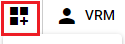

#####################################
Basics of object manipulation
#####################################

.. contents::

.. index:: open object

open the object
====================

1. Press each button from the Home tab or 3D Model tab of the ribbon bar.

.. |ribbon_home| image:: ../img/operation_initial_3.png
.. |ribbon_model| image:: ../img/operation_initial_4.png

==============  ===================
Home tab        3D model tab
--------------  -------------------
|ribbon_home|   |ribbon_model|
==============  ===================

For VRMs
    After loading, the terms of use confirmation screen (VRM information screen) will be displayed. If you don't give permission there, it won't really load.

For OtherObject
    When opening general Fbx, obj, etc., it can be opened by specifying it in the file dialog as it is, but there may be multiple necessary files such as textures.

    Due to the effect of the library used in this application, it is possible to read, for example, a zip file as is.

    example:
    Combine .obj, .mtl, .png, etc. into one zip file

    By reading the zip file created in this way with this application, you can read it with the texture etc. attached normally.

    .. warning::
        The 3D model file must have the appropriate texture settings in advance.

other than that
    It will be displayed immediately after loading.

.. note::
    * You can also drag and drop the desired VRM file from Explorer or Filer to the WebGL screen to open it.
    * By setting "Save opened files in history", history will be kept for each object once opened.

|

.. index:: basic shapes

Simple shaped objects
==============================

You can add basic objects that will be treated as OtherObjects.

1. Click "Basic Shapes" from the 3D Model tab of the ribbon bar.

|

* The following types of basic figures can be opened.

::

    sphere, capsule, cylinder, cube, plane (3D), quadrilateral (2D), water surface

.. admonition:: special water surface object

    A water surface object is a special object that keeps moving with animated waves.

    .. image:: ../img/operation_initial_6.png
        :align: center

    |

    There are a lot of texture properties, but if you set them in detail, you can express not only water and sea surfaces but also other uses. Please make good use of it.

|

.. index::
    Open from history
    Filter history

Open from history
======================

Once VRM/OtherObjects and images (including UI images) are opened, their history is saved in the app. You can open it from the history in the app without having to follow the dialog or drag it the next time you launch it.

1. Click History on the Home tab of the ribbon bar and select the target object type.

.. image:: ../img/operation_vrm_2.png
    :align: center

2. The internal storage dialog will open. Select the target object and open it.

.. hint::
    When opening from the history, you can narrow down the target file by entering it in the search box at the top of the list.

    .. image:: ../img/operation_initial_7.png
        :align: center

.. index:: delete history

Delete history
=====================

You can delete history that has accumulated too much.

.. |histdelbtn| image:: ../man4/img/loadsave_9.png

**delete individually**

1. Check the objects you want to delete.
2. Click |histdelbtn| at the top of the Internal Storage dialog.

|

**Remove All**

1. Press ``Settings`` on the Home tab of the ribbon bar.
2. Press ``Clear`` on the File tab.

|

.. index:: object selection

Object selection
============================

IK markers are displayed when all 3D objects become operable. To make it operational, select it in the object list. (Selecting Text and UImage does not display IK markers)

|

* When the corresponding object becomes operable, the IK marker will be displayed like this. (IK markers for other objects are hidden.

.. warning::
    Even if you select an object attached to VRoid/VRM, the IK marker will not be displayed. Unequip it to make it operable again.

|

.. index:: delete object

Delete object
==========================

To delete an object, right-click in the object list and click Delete Object.

.. image:: ../img/operation_initial_2.png
    :align: center

|

.. note::
    Animation project timelines (rolls) cannot be deleted this way. See :doc:`../man4/animation_proper` to delete both objects and timelines (roles).

|

.. index:: object rename

Object rename
=================================

Objects can be renamed. This is different from the name of the timeline (role) described later, and is the name/title of the object itself.

1. Right-click the object in the object list and click Rename.
2. Enter in the input dialog and press the OK button to confirm.

|

.. index:: focus the camera

Focus the camera
===============================

Adjust the position and rotation of the camera so that the target object fits in the main camera as much as possible.

1. Right-click an object in the object list and click Focus Camera.

.. index:: delete both this object and the role

Delete both this object and role
==============================================

Unlike deleting an object, it deletes both the object itself and the role (timeline).

Unless you have a very special reason, such as not wanting to delete the timeline (role) that registered the keyframe, we recommend deleting it with ``Delete both this object and role``.

1. Right-click the object in the object list and click "Delete both this object and the role".

|

.. index::
    moving objects
    object rotation
    magnification of the object

Move, rotate and scale objects
============================================

Common properties are available for all objects. Here you can move, rotate and scale.

.. |prop3d| image:: ../img/prop_common_1.png
.. |prop2d| image:: ../img/prop_common_2.png

.. csv-table::
    :align: center

    3D object, 2D object
    |prop3d|, |prop2d|

|

.. index::
     Move/Rotate/Magnify
     Operation by keyboard

3D object
---------------------

    3D objects operate on the X, Y and Z axes respectively. The movement and rotation here will be the object itself. (VRM does not cover IK of each part of the body)

    As a similar operation method, there is also an operation handle displayed by clicking the IK marker.

    It also supports keyboard operation. See :doc:`../man5/special_operation` for detailed operation instructions.

    .. warning::
        Only 3D objects can be operated with the keyboard. ``Text`` and ``UImage`` are **not keyboard accessible**.

|

    .. index:: 360 degree rotation (3D object manipulation)

    Consider 360 degree rotation
        When ``Consider 360 degree rotation`` is turned on, it tries to rotate as much as possible when the rotation angle is reached. For example, if you want your Y-axis to be:

        .. csv-table::
            :header-rows: 1
            :align: center

            frame, Y-axis rotation angle
            1, 0
            10, 359
    
        When registering a keyframe with this option OFF, the angle is only immediately switched from 0 degrees considering clockwise and counterclockwise rotation. If it is ON, it will try to make one rotation, eg 10..30..50..185..200.. between frames 2-9.

        * However, due to the internal rotation specifications of this application, it cannot be rotated from 0 to 360 degrees. Rotate to 359 degrees once, then register a keyframe on the next frame to rotate from 359 to 360 degrees. At that time, it is necessary to turn off ``Consider 360 degree rotation``.

        .. warning::
            This option is not saved as motion data. This is an option only when registering a keyframe. Toggling object selection will return this toggle to OFF.

    .. index:: fixed ratio (manipulation of 3D objects)

    fixed ratio
        You can also specify X, Y, Z for the magnification, but you can also fix the ratio. If you turn on ``Fix ratio``, there will be only one input field. If you enter in this state, you can change the size while maintaining the current ratio.

    jumping/swaying
        There are jump and shake functions as options related to the position and rotation of the object itself.

        Jumping works if the count is ``1 or more``.

        Linear and random shakes only work when each is ``On``.

2D object
----------------------

    Unlike the Unity editor, 2D objects have limited input fields for clarity.

    Position is X, Y, rotation is Z axis only.

    size
        Unlike 3D objects, it indicates the size of the area to be drawn.

    magnification
        It has the same size of meaning as a 3D object.