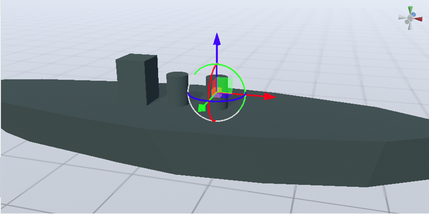
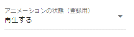

.. index:: OtherObject (manipulating objects)
.. index:: object (manipulating objects)

#####################################
OtherObject
#####################################

OtherObject basically handles general 3D models other than VRoid/VRM. There is only one IK marker per object except for VRoid/VRM, including OtherObject.

.. contents::

The display size follows the actual size of the 3D object, so it may differ greatly from VRoid/VRM and other objects. In that case, please change it in the "Magnification" property of the "Common" tab.

The IK marker is attached to the **object origin**. If the actual object and the origin are misaligned when outputting with Blender, etc., the IK marker and the actual object will also be misaligned in this application. If the misalignment is not what you intended, correct it appropriately on the output source app side.

.. note::
    * 3D objects with animation data such as FBX can be played with this application.
    * However, there may be restrictions on animation playback and selection depending on the specifications of the library used.

|

.. index:: Play animation (OtherObject)

play animation
---------------------

Animation of 3D objects can be played back even in animation projects using this application.

    
.. |preview| image:: ../img/operation_oobj_2.png

.. csv-table::

    For preview playback, animation registration
    |preview|, |anireg|
    It will play instantly. This operation is not registered in the keyframe. , After selecting "Play" or "Stop", register the keyframe.

1. Select the animation name to play.
2. Adjust the playback mode, animation speed, etc. as necessary.
3. Play to check.
4. If you like, select the playback state in the animation state (for registration) and register the keyframe.

.. note::
  * The animation data of the 3D object is not expanded or displayed in the keyframe, and only the states of play, pause, stop, and seek are registered in the keyframe.

.. hint::
    You can freely play the animation of the object even if you register only the seek position by changing the playback position in the key frame instead of playing or stopping.

    .. code::

        Example) FBX with a certain animation is made OtherObject

        1st frame: animation state (for registration) = change playback position, seek position = at 0.855

        2nd frame: Animation state (for registration) = change playback position, seek position = 0.124 point, duration is 1 second.

        → This FBX animates like reverse playback.

|

.. index:: Texture (OtherObject)

Texture
----------------

If the 3D object has multiple textures, you can select the texture and change the settings in detail. It's exactly the same as the VRM setting.

Please see :doc:`operation_texture` for details.