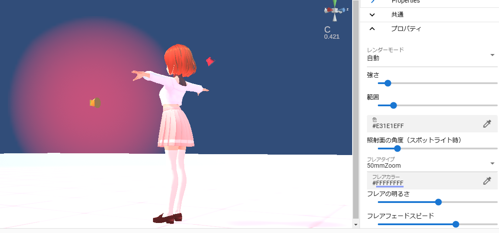

.. index:: Stage

#####################################
Stage
#####################################

Stage handles environments such as the floor, sky, and lighting.

.. contents::

Stage
^^^^^^^^^^^^^^^^^^^^^^^^^^^^^^^^^^^^

Select the stage from the combo box.

.. image:: ../img/operation_stage_1.png
    :align: center

|

* Example of changing the floor to "SeaNight" and the color of the sky

.. image:: ../img/operation_stage_2.png
    :align: center

|

.. index::
    Sweet Home 3D
    3D model of building

.. hint::
   * Please use OtherObjects to represent buildings and trees.

  
   To create buildings, gardens, etc., we recommend an application called "SweetHome 3D". Please search for details on how to use this software.

   http://www.sweethome3d.com/

   The point of using this software is that you can export 3D models in Obj format.

   When reading a 3D model (obj format) made by SweetHome3D with this application, compress the generated files below into a single zip file and use it.

   * obj file
   * mtl file
   * Other jpg, png files

   | In addition, the IK marker of this application is attached to the position equivalent to 0m position in SweetHome3D.
   | Also, the scale is quite large, so I recommend changing it to 1-3%.

Water stage
----------------------

    BasicSeaLevel, DaytimeWaterStage, and NighttimeWaterStage are stages on the surface of the sea and water. Each has a slightly different effect.

    The two types, DaytimeWaterStage and NighttimeWaterStage, are different shaders and shapes from BasicSeaLevel and water surface objects.

    ..
        It is a flat surface with rounded corners, and the horizon (horizontal line) is slightly lower than other stages.

    .. hint::
        By using the ``water surface`` in the basic shape of OtherObject, you can create a partial water surface while using the ground stage.

UserStage
----------------------

    UserStage is a type of stage where you can express yourself by pasting your favorite textures.

    1. Select ``UserStage`` from the combo box.
    2. Properties are displayed. Set them as you like.

    :Main texture:
        Separately load the texture file in advance and select the material name.
    :normal map texture:
        Load the normal map file in advance as a separate texture file and select the material name.
    :colour:
        texture base color
    :blending mode:
        Shader Mode
    :metallic:
        Metallic in shader
    :Glossy:
        Shader Glossiness
    :Luminous color:
        Shader Emission Color

    ..caution::
        Unlike VRMs and OtherObjects, shaders themselves cannot be switched.

    |

.. index:: lighting
.. index:: directional lights

Lighting (directional light)
^^^^^^^^^^^^^^^^^^^^^^^^^^^^^^^^^^

Lighting (Directional light) is represented by a figure like a red electric light on WebGL. You can specify the angle of light irradiation by rotating this with the operation handle. (Movement is not reflected. It is an effect only to make the operation handle easier to handle.)

.. image:: ../img/operation_stage_3.png
     :align: center

|

If the sky is normal sky and ``sky daytime``, it is also used as the sun position.

.. note::
    * Stage lights cannot be deleted like Light objects.

.. index:: object shadow (object manipulation)

**Object Shadows**

You can set the darkness of shadows in this application in the Stage properties. This setting is common to all objects.

.. image:: ../img/operation_stage_6.png
    :align: center

|

Also, depending on how the Light object is used, the strength and density of the shadows displayed by hitting other objects will change.

|

Halo
-------------

| A halo can be displayed on the Light object. However, due to Unity's specifications, it is not possible to dynamically fine-tune halo components for individual lights.
| In this application, you can control the halo for the whole with ``lighting``, which is a system light.

Specifically, you can finely control the halo by following these steps:

1. Specify the base value of the halo in the Stage's ``Lighting``.
2. Specify the color, strength and range of each light object.
3. The halo effect of each Light object changes.

|

As you can see, haze will be displayed around the light. You cannot clearly switch the halo ON/OFF of individual Light objects, but you can adjust it by specifying the halo's basic value and the range on the Light object side.

.. index:: wind (manipulating objects)

Wind
^^^^^^^^^^^^^^^^

By blowing the wind, the bones included in the VRM can be made to sway naturally. The wind is calculated by multiplying the strength of the wind by the fluctuation of the wind.

* The fluctuation of the wind is actually random within the following range.

| Minimum: degree of wind fluctuation * -1
| Maximum: How the wind fluctuates

.. image:: ../img/operation_stage_4.png
    :align: center

|

Then, you can make it blow at random intervals within the range of the minimum and maximum values specified in "Wind Blowing Timing". By specifying this appropriately, you can produce a natural wind.

.. warning::
    * The wind settings directly manipulate the gravity settings of the bones in the VRM. Do not use wind when setting gravity on the VRM side. Operations conflict.
    * Due to the specification change of SpringBone in VRM1.x, the behavior of this function has changed slightly. Please note that we will continue to make adjustments in the future.
 
|

.. index:: empty (object operations)

.. _operation_sky:

Sky
^^^^^^^^^^^^^^^^^^

The sky has two modes: normal sky and single color. The default is solid color. When set to "Single color", only the color of the sky can be set, but when set to "Normal sky", detailed settings can be made.

.. image:: ../img/operation_stage_5.png
    :align: center

|

.. |skydaytime| image:: ../img/prop_stage_2.png
.. |skynight| image:: ../img/prop_stage_3.png

.. csv-table::
    
    For sky daytime (daytime sky), for sky night blue/sky night purple (night sky)
    |skydaytime|, |skynight|

.. note::
   * Please refer to Unity's official reference for each setting.
   * For sky daytime, the sun is present. The position of the sun changes with the angle of rotation of the illumination.

.. warning::
    When anti-aliasing is enabled, two lines in ``sky night~`` may be mixed when captured. This is the WebGL specification. please note that.