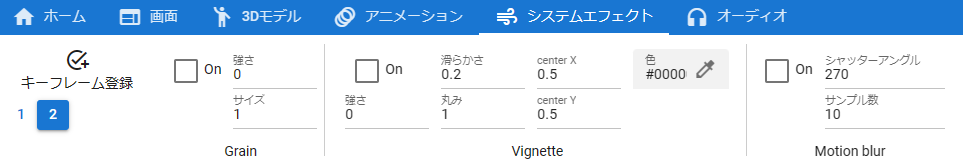

.. index:: SystemEffect (object manipulation)

#####################################
System effects
#####################################

SystemEffect is Post-processing in Unity's terminology. In order to make it easier for the public to understand, this application uses the name "system" + "effect" = "system effect".

.. |syseff1| image:: ../img/screen_ribbon_syseff1.png

.. csv-table::

    |syseff1|
    |syseff2|

|

SystemEffect can use the following Post-processing effects: Only some options, not all options.

::

    Bloom, Chromatic Abberation, Color grading, Depth of field, Grain, Vignette, Motion blur

.. warning::
    * If you use many effects, the operation may become slow.

|

.. |antialias| image:: ../img/operation_syseff_1.png

.. index:: screen transitions

**Screen Transitions**

Please use a combination of these system effects to create screen switching effects such as blacking out the screen.

|

.. index:: antialiasing

**About Antialiasing**

:|antialias|:
    Please set anti-aliasing in "Anti-aliasing" on the "Screen" tab of the ribbon bar, not in SystemEffect. (Cannot be registered to keyframes of animation projects)

**How to register for the animation project**

To register a system effect to an animation project, click the ``Register Keyframe`` button in the tab, or right-click [1]_ in the ``System Effects`` tab and click the ``Register Keyframe`` button. Click

.. image:: ../img/screen_ribbon_animation_keyframe2.png
    :align: center

|

* "Register keyframe" displayed when right-clicking in this tab is for system effects only. Even if you have selected any 3D object, it will **only target system effects**, so be careful not to make a mistake.

.. [1] Control key + click or double tap for macOS