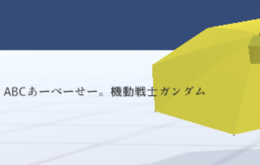

#####################################
Text
#####################################

Text is not a 3D object, but 2D like HTML. You can mainly display text as UI.
It is drawn with priority over 3D objects.

|

Unlike Unity, the X and Y coordinates that indicate the position are expressed with the upper left as (0, 0), similar to HTML, for clarity. Also, due to Unity's specifications, 2D objects are actually 3D objects, so they can be rotated using the X and Y coordinates. (X and Y coordinates are automatically set)

.. image:: ../img/prop_common_2.png
    :align: center

|

Of course, Text also supports animation projects.