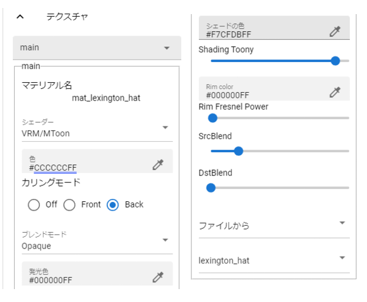
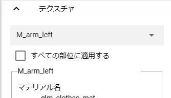

.. index:: OtherObject (manipulating objects)
.. index:: object (manipulating objects)

#####################################
Texture
#####################################

Texture settings are common to VRM and OtherObject.

.. contents::

Please see each site for detailed explanations.

.. csv-table::

     Standard Asset Water, https://docs.unity3d.com/en/2019.1/Manual/HOWTO-Water.html
     MToon reference, https://virtualcast.jp/wiki/unity/shader/mtoonreference
     Drawing style shader, https://usagi-meteor.booth.pm/items/4453497
     Comic Shader, https://booth.pm/ja/items/2138884
     Ice Shader, https://booth.pm/en/items/2138863

Working with textures
=========================

You can finely change the settings of the textures held by VRM and OtherObject. Both settings and usage are exactly the same.

|

1. If there are multiple materials, select the target material from the upper combo box.

* The contents of the texture settings are switched.

2. Change various settings as you like.

Apply to all parts
-------------------------

|

Basically, it will be set for each material, but if there are many materials or you want to change the appearance of the model all at once, check this option and change the texture setting This will allow you to change them all at the same time.

You cannot select the material while it is checked.

Texture details
=============================

:shader:
    ``Standard``, ``VRM/MToon``, ``VRM10/MToon1``, ``Water``, ``Sketch``, ``PostSketch``, ``Comic``, ``Ice``, Select either

.. caution::
   * Texture changes are not actually changed, only while using this app.
   * The opacity of each color property may not be properly reflected in WebGL. note that.
   * If there are multiple textures (meshes) that use the same material, only the settings of the last texture will be reflected in the final animation project. (e.g. if there are 3 textures using material A, the 3rd setting will be applied last)
   * VRM 0.x models also comply with VRM 1.x specifications when loaded with this app. Therefore, basically use ``VRM10/MToon10`` shaders.

Standard
--------------------

Unity standard texture.

:colour:
    Change the base color of the texture.
:blending mode:
    Choose from ``Opaque``, ``Cutout``, ``Fade``, or ``Transparent``.

:culling mode:
    Select ``Off``, ``Front``, or ``Back``.
:metallic:
    Makes the surface look like metal.
:Glossy:
    Adds shine to the surface.
:Luminous color:
    Emission Color.
:Texture type:
    Select ``From File`` or ``From Camera``. In either case, you can unreference it by choosing ``--``.

    From file [1]_
        Select and load the material name given to the separately loaded texture file. Select ``--`` to return to the original texture.
    From camera [2]_
        Select a camera object that exists in your project. It is necessary to set the render texture separately on the camera object side.

.. hint::
    .. [1] Load the necessary texture files in advance from the ``Animation`` tab on the ribbon bar → ``Settings`` button → ``Material`` tab.
    .. [2] Set the render texture in the Camera object in advance.

VRM10/MToon10
--------------------

VRM 1.0 standard shader. It is slightly different from that of VRM 0.x.

:colour:
    Change the base color of the texture.
:blending mode:
    Choose from ``Opaque``, ``Cutout``, ``Fade``, or ``Transparent``.

:culling mode:
    Select ``Off``, ``Front``, or ``Back``.
:cut off:
    0.5 is the base value. Anything lower than that will gradually reveal missing textures. 1.0 is completely transparent.
:Luminous color:
    _EmissionColor.
:Shade Color:
    _ShadeColor.
:Shadow border smoothness:
    Shading Toony.
:Shadowed area:
    It's Shade Shift.
:Shadow acceptance:
    Receive Shadow.
:Shading grade:
    Shading Grade.
:Degree of reflection of ambient light:
    Light Color Attenuation.
:Rim light color:
    Rim color.
:Rim light border strength:
    Rim Fresnel Power.
:SrcBlend to DstBlend:
    Applies complex changes in color and transparency. For details, please search the explanation site of VRM/MToon.

:Texture type:
    Same as Standard.

Water
----------------

A shader that represents the water surface.

:Fresnel scale:
    Fresnel Scale.
:Reflective color:
    The color of the water surface when illuminated by light.
:mirror color:
    The color of the reflection on the water surface.
:wave amplitude, wave frequency, wave steepness, wave velocity, wave direction AB, wave direction CD:
    Changes the frequency and magnitude of waves.

Sketch, PostSketch
-------------------------

This is a shader that creates a sketch-like depiction.

:outline width:
    Draw lines around textured objects.
:Stroke density:
:extra brightness:
:Multi Brightness:
:shadow brightness:
    Sketch only.

.. admonition:: Where to buy/distribute

    rabbit meteor shower

    https://usagi-meteor.booth.pm/items/4453497

Comics
--------------

It is a shader that creates a cartoon-like depiction.

:texture transparency:
     The effect is similar to the VRM10/MToon10 cutoff. Make missing textures transparent.
:line width:
     Draw lines around textured objects.
:colour:
     Change the color of lines and shadows.
:Tone Threshold:
     Change the tone range.

.. admonition:: distribution

    Dear Xin Games

    https://booth.pm/ja/items/2138884

Ice
------------

This is a shader that renders like ice.

:colour:
    Change the color of the ice surface.
:Transparency:
    If the transparency is a positive value, the color becomes clear as ice. As it approaches 0, it becomes transparent. More negatives start to invert colors instead of being transparent.
:Basic transparency:
    Multiply the transparency by the transparency.
:Roughness of ice:
    Rough the ice into jagged edges.
:distortion:
    Changes the twist of the shape of the reflection on the ice.

.. admonition:: distribution

    Dear Xin Games

    https://booth.pm/ja/items/2138863

|

Pixelize Texture
---------------------

It is a shader that becomes a certain block-like texture. This is a custom shader made from scratch by ChatGPT.

:pixel size:
    The size of the texture to pixelate. The larger this is, the more mosaic-like it becomes.
