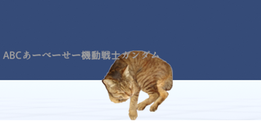
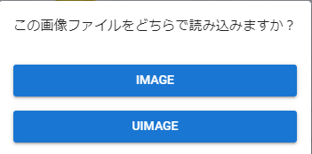

#####################################
UImage
#####################################

Similar to Text, UImage also displays images as UI rather than 3D objects.
It is drawn with priority over 3D objects.

|

.. note::
    UImage is drawn below Text.

Also, when you drag and drop an image, a confirmation message will be displayed as to whether to load it as an Image or a UImage. Click on the desired type to proceed with loading.

