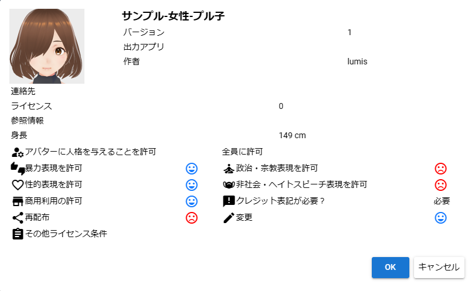
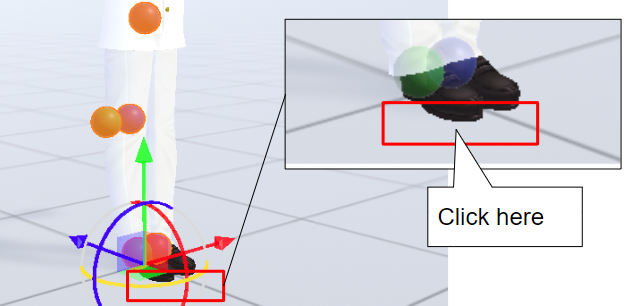
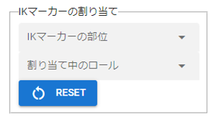
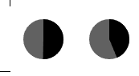

#####################################
VRoid/VRM
#####################################

The main feature of this app is that you can load a VRoid/VRM and create poses or create animations that will be described later. We will explain a series of operations from loading VRM files to actual operations.

.. caution::
    This app can also read VRM 1.0 models correctly.

    However, we have not been able to confirm the use cases of functions such as constraints that were newly implemented in VRM1. We will check the operation and support it in future updates.

.. contents::

.. index:: Check VRM Terms of Use

Check VRM Terms of Use
--------------------------------

As the loading progresses, the VRoid/VRM usage conditions confirmation screen will be displayed. If you read a VRM file made by a creator other than yourself, check the terms of use carefully and if you agree, press the "OK" button to complete the reading.

After this, the desired VRoid/VRM will be displayed on the WebGL screen.

.. note::
    * If you open VRM from history, you can skip this confirmation screen depending on the option.
    * VRoidStudio 1.x and 0.x models have different joint shapes and initial poses. This app absorbs the difference as much as possible, but the initial display of IK in 11 and 13 on the next page will be slightly off in the model immediately after output from VRoidStudio 1.x (there is no problem if you start moving).
    * VRM 0.x and VRM 1.x models have different joint shapes, so the initial pose is slightly different. There is no problem if you start moving this as well.

|

.. index:: IK marker operation (VRM operation)

.. _inputikasmarker:

Working with VRM IK markers
-------------------------------

The imported VRoid/VRM has a translucent figure called an IK marker as shown in the figure. Each is linked to the movement of the following parts. Also, the type of IK marker operation is determined for each part.

.. image:: ../img/operation_vrm_6.png
    :align: center

|

.. csv-table::
    :header-rows: 1

    No, part, corresponding operation,         No, part, corresponding operation
    1, Line of sight (EyeViewHandle), Movement, 2, Tilt the head to the left and right / stick out the chin (Head), Rotation
    3, Head orientation (LookAt), Movement,     4, Upper body orientation (Aim), Movement
    5, Upper body/shoulder left/right tilt (Chest), Movement, 6, Waist direction/tilt/Movement (Pelvis), movement/rotation
    7, left shoulder (LeftShoulder), rotation,  8, left elbow (LeftLowerArm), movement
    9, Left Hand, Move/Rotate , , ,
    10, RightShoulder, Rotation,        11, RightLowerArm, Movement,
    12, Right Hand, Move/Rotate, , ,
    13, left foot direction (LeftLowerLeg) ≠ knee, movement, 14, left ankle (LeftLeg), movement/rotation
    15, right foot direction (RightLowerLeg) ≠ knee, movement, 16, right ankle (RightLeg), movement/rotation

.. note::
     * Even if you perform an unsupported operation, that part will not move.
     * This is the only part that can be manipulated so that you can freely edit the pose without being complicated and troublesome as much as possible. Therefore, it does not support FK (Forward Kinematics), which requires a huge number of operations.
     * There may be a strict way of saying this in the world, but in this app, each bone (part) above is described as an IK marker (part).
     * 13 and 15 are not the same as knees. Think of it as the overall direction of your foot.

|

Operation of each IK marker
^^^^^^^^^^^^^^^^^^^^^^^^^^^^^^^^^^^

When you click each selected IK marker, it will look like the picture. This is the operating handle.

.. image:: ../img/operation_vrm_7.png
    :align: center

|

X, Y, Z axis movement
    With green = Y, blue = Z, and red = X axis, dragging will move the IK marker in that direction. The corresponding part of the body also moves by the amount of movement.

center plane
    The square box in the middle with the same color can be moved freely on the axis indicated by the surface and the other axis by dragging inside it.

.. index:: Special operation of IK marker (VRM operation)

.. _specialoperation_vrm:

special operation
^^^^^^^^^^^^^^^^^^^^^^^^^

You can use special functions by pressing the following keys with the IK marker selected.

Ctrl-click IK marker
    You can select multiple IK markers. You can move multiple body parts at the same time by moving or rotating with multiple selected.
    In addition, since the operation handle also has a collision detection, please select only the IK marker by zooming the camera.

Press X key
    Switch between global coordinates and local coordinates. Default is local coordinates.

press G key
    Move IK markers only.

Press R key
    Set the IK marker to rotation only.

Press the T key
    Returns the IK markers to their initial state. (Both movement and rotation)

Press Shift + Z
    Undo movement/rotation by IK marker.

Press Shift + Y
    Redo movement and rotation with IK markers.

|

.. index:: Move/Rotate (VRM operation)

Movement/rotation of VRoid/VRM itself
^^^^^^^^^^^^^^^^^^^^^^^^^^^^^^^^^^^^^^^^^^^^^^

To move/rotate the selected VRoid/VRM itself, turn on "Movement mode" in the "IK, whole body" tab of the property on the right.

.. image:: ../img/operation_vrm_8.png
    :align: center

|

Then, when you click near the feet of the VRoid/VRM, all IK markers will be selected. Although it is not displayed, this is actually the entire IK marker.

.. warning::
    Since the ankle and the overall IK marker tend to interfere, please switch to OFF when not moving.

|

If you move or rotate up, down, left, or right in this state, the VRoid/VRM itself will move accordingly. This can also be set numerically from the "Common" tab of the properties.

.. image:: ../img/prop_common_1.png
    :align: center

You can also adjust the overall size of the VRoid/VRM from the common tab, but the ideal size of the VRoid/VRM is the size at the time it is loaded. We recommend that you do not change this ratio too drastically. (Because it does not follow the size of the IK marker itself, the position of the IK marker and the body part will be misaligned.)

|

.. index:: Return to T pose (VRM operation)

Return all bones to T pose
^^^^^^^^^^^^^^^^^^^^^^^^^^^^^^

If you mess with the IK markers too much and can't return to the desired pose, you can return to the T pose (default pose) by pressing **Reset all bones** on the **3D model** tab of the ribbon bar.

.. image:: ../img/operation_vrm_a.png
    :align: center

|

Also, the overall position and rotation can be returned with **Reset Position** and **Reset Rotation**.

.. image:: ../img/operation_vrm_b.png
    :align: center

|

.. index:: Manipulate IK markers numerically

.. _inputikasnumber:

Numerical manipulation of IK markers
^^^^^^^^^^^^^^^^^^^^^^^^^^^^^^^^^^^^^^^^^^^

In addition to operating the IK marker with a mouse or touch, you can also operate it by entering actual numbers. Select the desired VRoid/VRM, and press the "**IK position batch change**" button on the "**IK, whole body**" tab of the properties on the right.

|

.. |btnbonetranapply| image:: ../img/operation_vrm_l.png
.. |btnbonetranrel| image:: ../img/operation_vrm_m.png
.. |btnbonetranmirror| image:: ../img/operation_vrm_n.png

| A dedicated dialog will be displayed. Here you can directly specify the position and rotation of each IK marker in a spreadsheet format. Finally, press the |btnbonetranapply| **Apply Pose** button when you have finished changing the desired parts.
| Then the current pose of the target VRoid/VRM will be changed accordingly.

.. image:: ../img/screen_ikmarker.png
    :align: center

|

The function of each button is as follows.

|btnbonetranrel| Refresh
    Reflects the pose information of the currently selected VRM in the spreadsheet. Basically, if you select it, it will be automatically reflected, but the information may remain old depending on the operating state of the application. Use it in that case.

|btnbonetranmirror| Reverse pose
    Swap the left and right of the current pose information. In this state, pressing **Apply Pose** will result in the current pose being reversed.

.. note::
   * Buttons in toolbar are disabled while non-VRM is selected.
   * Numbers here are current VRM specific numbers. Since height and body differences are not reflected, it is necessary to calculate manually when using it with other VRMs.

|

.. index:: Adjust the movable range limit (VRM operation)

Adjust the range of motion limits
^^^^^^^^^^^^^^^^^^^^^^^^^^^^^^^^^^^^^^

| In this application, some control of the range of motion is applied to the VRM as standard. With them, VRM can reproduce natural human body movements without difficulty.
| However, it sometimes conflicts with the IK of this application, and due to that, there are specifications that poses and animations cannot be reproduced. If you want to pose completely freely even if it is a little unnatural as a human body, you can remove the restrictions of these IK markers.

Direction of the foot (LowerLeg), rotation angle of the ankle (Leg) on the X axis, rotation angle of the elbow (LowerArm) on the Y axis
   * Elbow, below the knee, ankle rotation range is limited along the actual human body.
   * It can be turned on/off by "Model tab" → "Apply natural movement control to VRM's body" on the setting screen.

X-axis rotation of the ankle (Leg) after moving the direction of the foot (LowerLeg)
   * When the foot (LowerLeg) is moved back and forth, the rotation angle of the ankle (Leg) is rotated according to the LowerLeg.
   * You can switch on/off by "Model tab" → "Auto rotate ankle" on the setting screen.

|

Interlocking IK markers
^^^^^^^^^^^^^^^^^^^^^^^^^^^^^^^

| In this app, IK markers are used to move VRM bones, and moving the IK marker of a specific part moves other parts in conjunction.
| Basically, this is only for when operating IK markers.

Interlocking the following three patterns
    Around the shoulder (Chest) and arms (LowerArm) / Head (Head)
        When moving the Chest, move the X and Z axes of the LowerArm and Head as much as possible.
    Aim and near the shoulder (Chest)
        Move the X and Z axes near the shoulder (chest) as much as possible when moving the aim.
    Hips (Pelvis) and Legs (LowerLeg)
        When you move your hips up and down, your legs (Lower Leg) move slightly back and forth according to the movement.
    Interlocking ankle (Leg) and foot direction (LowerLeg)
        Slightly move the foot (LowerLeg) back and forth when the ankle is moved
    Interlocking Hand and Lower Arm
        When moving the hand, the arm (elbow) also moves

.. hint::
    It can be turned on/off by selecting "Model tab" → "Bone linkage" on the setting screen.

.. warning::
    The interlocking problem that existed in ver 1.x has been resolved in ver 2.0.2.

    It turns off automatically during animation playback, and the position and rotation registered in the keyframe are reflected.

    If you turn it off, it will not be linked and you will be free, but the joint will bend in a direction that should not be bent.

|

.. index:: Switch IK marker to another object (VRM operation)

Switch IK markers to different objects
^^^^^^^^^^^^^^^^^^^^^^^^^^^^^^^^^^^^^^^^^^^^^^^^^^

| The VRM has IK markers set according to the parts mentioned above, and moving them changes the pose. A different object can be assigned to that IK marker that marks the movement of each part of the body.
| I will explain what happens when you do this.

|

Select the part of the IK marker and select the object to assign to that part. Selectable objects are:

| **Self** ・・・Return to the original IK marker.
| **Main Camera**・・・The main camera of the app
| **each VRM, OtherObject, Light, Camera, Image, Effect**... other 3D objects

.. note::
    | * Head, LeftShoulder, and RightShoulder cannot be selected for the part.
    | * It cannot be assigned to yourself, 2D objects, SystemEffect, Audio, or Stage.

.. caution::
    Each VRM's IK automatically reverts to default if you delete the object you're assigning it to.

|

**Using VRM A and VRM B and an effect object**

.. image:: ../img/operation_vrm_e.png
    :align: center

|

If you move the effect object in this state, characters A and B will turn around and match their gaze in that direction.

"It is also possible to reflect this setting and state in the animation." The contents to be registered in the animation project are as follows.

.. csv-table::
    :header-rows: 1
    :align: center

    object, operation to register
    Allocation of VRM and IK markers
    assigned objects, such as actual translations and rotations

|

..
    Head IK movement amount
    ----------------------

    The head IK is actually separate from the whole body IK, and when the whole body moves, only the head may move unexpectedly. You can control the amount of that movement with this setting.

    .. image:: ../img/operation_vrm_k.png
        :align: center

    |

    | Set to ``0`` to keep the head stationary (no left or right tilt). LookAt and EyeViewHandle move, so basic head movements are still possible.
    | ``1`` or more will adjust the degree of follow-up of the slope.

    |

.. index:: Hand pose operation (VRM operation)

Manipulating hand poses
----------------------------

To operate the palms, open the "Arms/Hands" tab from the properties on the right and select the pose you like for the left and right hands.

.. image:: ../img/prop_vrm_2.png
    :align: center

You can adjust the degree of pose with the slider. More hand poses will be added in future updates.

As of Ver 1.0.0:
   * generally
   * open
   * Goo
   * pointing
   * V sign
   * Thumbs Up
   * grasp

From Ver 1.0.4, the following has been supported.
   * manual operation

.. image:: ../img/prop_vrm_8.png
    :align: center

|

.. |imgfinger2| image:: ../img/prop_vrm_9b.png

|imgfinger1| **thumb to pinky joints**
    Each slider rotates a knuckle. The top is the 1st joint to the 2nd joint, and the bottom is the 3rd joint.

|imgfinger2| **Operation of the finger itself (between fingers, rotation of finger axis)**
    | The red slider adjusts the spread between the fingers with the slider.
    | The green slider rotates around the finger axis. (It's not possible as a real human, but it's a rotation operation that is often necessary with 3D models.)

|imgfinger3| **Base of thumb**
    You can adjust the rotation of the base of the thumb with a circular slider. The left represents the perspective distance between the thumb and the palm, and the right mainly represents left-right rotation.

|

|

.. index:: Blendshapes (manipulating VRM)

.. _blendshape_vrm:

blend shape
---------------------

To put it simply, you can switch between VRoid/VRM facial expressions, etc. Open the "Blendshape" tab of the property on the right, and adjust the value of your favorite blendshape with the slider.

..
    There are two types of blendshapes: ``general'' and ``dedicated``. For those who are familiar with Unity and Blender, SkinnedMeshRenderer is ``general'' and VRMBlendShapeProxy is ``dedicated`` in this application (VRM 1.x is called Vrm10RuntimeExpression (also simply Expression)) increase).

.. image:: ../img/prop_vrm_4.png
    :align: center

|

* Blend shapes are determined for each VRM file, and the number that can be manipulated varies depending on the character.
* Move the slider next to each shape key between 0 and 100.

Search
    You can incrementally search by blendshape name. If blank, all blendshapes will be displayed.

.. index:: Notes on blendshapes

Dedicated and common blendshapes
    :Exclusive: Each VRM has its own shape. Even if the shape here is made into a motion or pose file described later and applied to another VRM, it may not be reproduced.

    :Common: Shape common to all VRM1.0 models and migration models from VRM0.x. The shapes here can be reproduced in other VRMs by putting them in a motion or pose file.

    The name has been changed due to VRM1.x support.

    Due to the specifications of VRM 1.0, the behavior of SkinnedMeshRenderer's blend shapes has been affected, and some ``general-purpose`` shapes that used SkinnedMeshRenderer in this application no longer work. This application maintains compatibility and can be used, but since it may cause confusion, we have changed the name as follows.

    .. csv-table::
        :align: center

        This app version, SkinnedMeshRenderer shape, Expression shape
        Ver 2.0, Dedicated, Common
        Ver 1.x, general purpose, dedicated

    .. caution::
        Note that ``private`` is **reversed**.

    .. note::
        * The original Expression only has the bare minimum of common shapes for all VRMs.
        * There is a possibility that the number of Expressions is small in other applications, but that is the standard state. This application emphasizes compatibility, so we have made it possible to use all blendshapes as Expressions with our own improvements.

    

Automatic blink
^^^^^^^^^^^^^^^^^^

"Automatic blinking" keeps the VRM blinking at the specified timing.

.. image:: ../img/prop_vrm_3.png
    :align: center

|

Since it continues to move independently of the animation keyframes, there is no need to incorporate the opening and closing of the eyes into the keyframes from scratch.

Blink interval, number of seconds the eyelids open, number of seconds closed, number of seconds closed
    By specifying each of them, you can feel the expression even with the movement of the eyes.

It is on by default. If you don't need it, uncheck "Enable automatic blink" to turn it off.

.. caution::
    Competes with the eye blendshape. We recommend that you use one or the other.

|

.. index:: Object attachment (VRM operation)

Wearing an object
----------------------

You can link different objects such as FBX, Obj, Light, etc. to specific body parts of VRoid/VRM and link their movements. Open the "Attach Objects" tab in the properties on the right.

.. image:: ../img/operation_vrm_f.png
    :align: center

|

1. Add another object in advance.

.. image:: ../img/operation_vrm_g.png
    :align: center

|

.. note::
   * Adjust the position and rotation according to the part of the body you want to tie.

2. Select VRoid/VRM, select the target body part, and click the Add button.

.. image:: ../img/operation_vrm_h.png
    :align: center

3. Select the object you want to link and press the "OK" button.

.. image:: ../img/operation_vrm_i.png
    :align: center

|

The objects that can be worn are as follows.

.. csv-table::
    :header-rows: 1
    :align: center

    Object type
    3D objects such as FBX and Obj
    Image
    Light
    camera
    Effect

4. The information of the attached object will be displayed.

.. image:: ../img/operation_vrm_j.png
    :align: center

| After that, the attached object will move in conjunction with the part of the body.
| You can remove it with the delete button on the right.

.. caution::
    | * Handling of attached objects
    | For objects equipped with VRM, it will no longer be possible to register deformation operations such as position and rotation in keyframes during animation. Even if you select it from the list, the IK marker will not be displayed.
    | Make sure to set various properties before installation.

.. admonition:: About wearing objects in animation projects
    
    | Because the attachment of this object has a complicated mechanism, please be careful when using and preparing for animation. Attaching and removing an object must be **separate from the start/end of the desired motion**.
    | It is a good idea to register in the keyframes in the following order.

    example:
        Equip a 3D sword object on the VRM's right hand

    .. csv-table::
        :header-rows: 1

        Frames, VRMs, and other objects
        1, move right hand into position, move sword into position
        2, **attach a sword object** to the right hand, none
        ～, ,None
        9, finish moving right hand, none
        10, **Release the sword attached to the right hand** , Register the current position and rotation in the keyframe

    * Other object properties cannot be changed between 2 and 10 frames.
    * The point in the animation is that the wearing state is the same at the start and end. For example, if the 1st frame is without attachments and the 10th frame is with attachments, if you operate the frame or press the play button again, the position of the object may gradually shift.

|

gravity settings
--------------------

Bones possessed by VRoid/VRM are equipped with gravity settings as standard. Bones usually move automatically by Unity's standard collision detection function during game and motion production.

Even with this app, hair flutters when the VRoid/VRM moves, but you can make fine adjustments manually.

Although this is an effect only for this app, for example, you can correct the phenomenon in which the skirt rolls up too much with this gravity setting.

.. warning::
    Conflicts with the stage wind effects and settings described below. Do not use this feature when using wind.

.. image:: ../img/screen_gravity.png
    :align: center

|

The information on the gravity settings of the bones of the VRM being operated is listed on the spreadsheet. The bones displayed here are:

* Bones that the VRM itself has (already held during creation in VRoidStudio)
* Bones held by 3D models retrofitted to VRM with tools such as the Unity editor and my work VRMOneEditor

Also, since it should have gone through conversion with UniVRM once, it relies on the ``VRMSpringBone`` component for bone information.

Please check in advance on VRoidStudio or Unity what bones are actually located. The cells that can be changed are:

.. csv-table::

    **Power**, the direct strength of gravity on that bone (0 to 1)
    **Direction X / Y / Z**, Directional strength of gravity applied to the bone (-1 to 1)

.. note::
   * -1 in each Direction is the negative direction. For example, the Y axis will be downward. (1 means up)
   * How the bones flutter due to gravity is reflected in ``Power * Direction``.
   * Press the load button on the toolbar to reload the latest information.

Texture
----------------

You can change the settings of the textures held by the VRM in detail. The setting and usage of OtherObject are exactly the same.

Please see :doc:`operation_texture` for details.