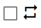

.. index:: Audio (property)

#####################################
Audio
#####################################

.. image:: ../img/screen_ribbon_audio.png

|

Audio properties. You can find this in the Audio tab of the Ribbon bar.

.. image:: ../img/prop_audio_1.png
    :align: left

Switches the type of audio to operate.

|
|
|

Load the audio file you want to use.
Removes imported audio.

|
|
|

Targets the loaded audio for manipulation.

|
|
|

Select the audio state for keyframe registration.

|
|
|

.. image:: ../img/prop_audio_5.png
    :align: left

Play/pause/seek for preview.

.. warning::
    SE cannot seek.

|
|
|

Toggles loop playback.

|
|
|

.. image:: ../img/prop_audio_7.png
    :align: left

Change the volume.

|
|
|

.. image:: ../img/prop_audio_8.png
    :align: left

Change the pitch of audio.