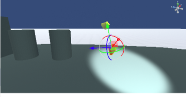

.. index:: Camera (property)

#####################################
Camera
#####################################

|

Settings for a camera object that is separate from the main camera. This is called a sub camera.

:Camera status (for registration):
  Select whether to project the sub camera.
:preview:
  Displays the image of the sub camera. During display, the image of the main camera is hidden below.
:Vision:
  Widens or narrows the field of view of the camera. In Unity it is the field of view (FOV).
:Depth:
  Priority of camera display. To make it easier to understand, it is an image similar to the effect of CSS z-index.
:Viewport:
  Specify the display range of the camera image on the WebGL screen.
:Render texture:
  Used in combination with OtherObject. Used to project the camera image onto another object.

  :X, Y:
    The size of the image projected from the camera
  :ON/OFF:
    Enable Render Textures.

|

.. |shikai60| image:: ../img/prop_camera_3.png

.. list-table::
  :header-rows: 1

  * - Visibility = 30
    - Sight = 60
  * - |shikai30|
    - |shikai60|

.. list-table::
  :header-rows: 1

  * - Viewport = 0, 0, 1, 1
    - Viewport = 0, 0, 0.5, 0.5
  * - |vp0011|
    - |vp0055|