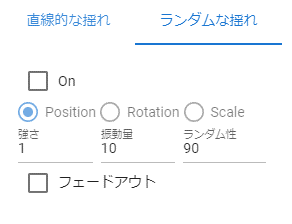

.. index:: property (common)

#####################################
Common
#####################################

.. contents::

.. index::
    Properties (3D model)
    360 degree rotation (3D model)
    Fixed ratio (3D model)

Common (3D model)
--------------------

This is a transformation property that can be used in common for 3D models.

.. image:: ../img/prop_common_1.png
    :align: center

|

:Position:
    Set the X, Y, and Z coordinates respectively.
:Rotate:
    Set the X, Y, and Z coordinates respectively. When ``Consider 360 degree rotation`` is turned on, it tries to rotate as much as possible when the rotation angle is reached.
:Scale:
    Set the magnification for all coordinates. If you turn on ``Fix ratio``, you can fix the X/Y/Z coordinates and only need one input.

.. note::
    Magnification is only X/Z coordinates for Stage. Other 3D model objects are X/Y/Z coordinates.

.. index:: jump (common property)

Jump (common)
^^^^^^^^^^^^^^^^^^
:number of times:
    Specifies the number of times to jump.
:strength:
    Sets the strength (the amount added to the current Y-axis).

.. warning::
    In an animation project, if the keyframe interval is too short, it can appear to jump too quickly.

|

.. index:: linear swing (common property)

Linear sway (common)
^^^^^^^^^^^^^^^^^^^^^^^^

This is a setting for the linear shaking animation effect that can be used commonly for 3D models.

.. image:: ../img/prop_common_3.png
    :align: center

|

:On:
    Enable.
:Position, Rotation, Scale:
    Type of shaking.
:X, Y, Z:
    Specifies the swing direction.
:Vibration amount:
    Specifies the number of shakes.
:Elasticity:
    Specifies the upper limit of the bounce range when shaken.

|

.. index:: random shaking (common property)

Random shaking (common)
^^^^^^^^^^^^^^^^^^^^^^^^^^

This is a random shaking animation effect setting that can be used commonly for 3D models.

|

:On:
    enable
:Position, Rotation, Scale:
    type of shaking
:strength:
    Specifies the strength of shaking
:Vibration amount:
    specify the number of swings
:Randomness:
    Specifies the randomness of shaking
:Fade out:
    Allow it to taper off when the shaking ends. (If it is off, it will end quickly.)

|

.. warning::
    | Jumps, linear shakes, and random shakes do not work properly in consecutive frames in the animation described later. (due to the specifications of the library used)
    | If you really want to use them continuously, be sure to insert a frame of those non-moving operations in between.

|

.. index:: property (2D model)

Common (2D model)
--------------------

This is a transformation property that can be used in common for 2D models.

.. image:: ../img/prop_common_2.png
    :align: center

|

:Position:
    Set the X and Y coordinates as **percentages**. Therefore, if the screen size changes, the position may shift slightly.
:Rotate:
    Sets the angle of rotation for the Z coordinate only.
:Size:
    Set the X and Y coordinates as the direct drawing area.
:Scale:
    Set the scale of X coordinate and Y coordinate respectively. Unlike size, this one scales.