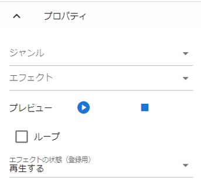

.. index:: Effect (property)

#####################################
Effect
#####################################

.. contents::

Main property
---------------------

|

This is a special screen effect that animates, and settings related to effects.

:Genre:
    Select the effect genre. (see below)
:Effect:
    Select an effect for the selected genre.
:Preview:
    Play/pause/stop the effect preview. Because it is a preview, it is not reflected in the animation project.
:Loop:
    Play the effect forever.
:Effect status (for registration):
    Register the playback status of the effect in the animation project.

.. csv-table::

    Explosion, explosive effects
    Smoke, smoke and haze effects
    Water, effects related to water
    Action, other effects

|

.. index:: collision property with VRM (property)

Collision properties with VRM
--------------------------------------

.. image:: ../img/prop_effect_2.png
    :align: center

|

This is the property of the effect that uses the collision function.

:Using Collision Features:
    Enables collisions for this effect object.
:Collision area size:
    Specifies the extent of collision as a number. The size of the sphere preview on the screen also changes.
:Target VRM:
    A combo box that selects the VRM that is the target of the collision.
:Enter button:
    Decide on your chosen VRM.
:VRM list:
    A list of VRMs that this effect object collides with. You can remove it from the target with the delete button on the right end.