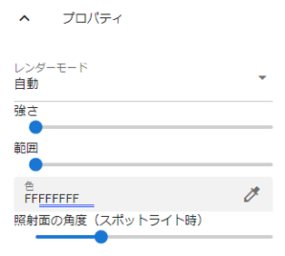
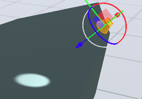
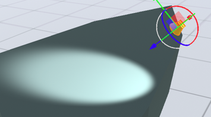

.. index::Light(property)

#####################################
Light
#####################################

|

:render mode:
    Whether to display the corresponding light object with priority. If there is more than one "Automatic", the light will interfere with Unity's specifications and it will not be displayed correctly, so please use one "Important" appropriately.
:strength:
    is the intensity of light.
:range:
    Specify the range where the light reaches. When using a spotlight, it will be the distance.
:colour:
    It's the color of the light.
:Irradiation surface angle (for spotlight):
    Only spotlight is valid. Switch the illumination angle. This indicates the extent to which the light shines. The actual effect is shown below.

.. list-table::
    :header-rows: 1

    * - Irradiation surface angle = 16 degrees
      - Irradiation surface angle = 56 degrees
    * - |sho16|
      - |sho56|

:flare type:
    Select the type of light flare from ``None``, ``50mmZoom``, ``FlareSmall``, and ``Sun``.
:flare color:
    Specifies the flare color.
:flare brightness:
    Specifies the brightness of the flare.
:flare fade speed:
    Specifies the speed at which flares appear and disappear.