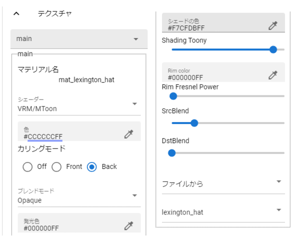

.. index:: OtherObject (property)

#####################################
OtherObject
#####################################

.. contents::

.. index:: texture (property of OtherObject)

Texture
--------------------

|

Among the settings related to OtherObject, this is a property related to texture. If the object has multiple textures, you can select from the combo box. The number of textures that can be detected depends on FBX, OBJ, etc.

:Material name:
    The name of the material held by the currently selected texture.
:shader:
    Switch the shader to Unity's Standard, VRM's VRM/MToon, or StandardAsset's Water (FX/Water4).

You can change the settings of the following shaders. For details, please refer to Unity Help.

:Standard:
    Color, Blend Mode, Metallic, Glossy, Emission Color, Texture
:VRM/MToon:
    Colors, Blending Modes, Culling Modes
    Metallic, Glossy, Emission Color, Shade Color
    Shading Toony, Rim Color, Rim fresnel power
    SrcBlend, DstBlend, Texture
:Water:
    Fresnel scale, reflection color, specular color, wave amplitude, wave frequency, wave steepness, wave velocity, wave direction AB, wave direction CD

.. hint::
    The VRM texture properties, contents, and setting methods are exactly the same.

|

.. index:: animation (property of OtherObject)

animation
--------------------

.. image:: ../img/prop_obj_2.png
    :align: center

|

In the case of FBX with animation set, it can be registered for preview playback and animation projects.

:animation name:
    If multiple animations are set, select them here.
:Preview play/stop:
    If animation is set, it will play/stop. Playback here is just a preview.
:Playback mode:
    Select the animation play mode from ``Default``, ``Loop``, and ``PingPong``.
    
    :Default:
        Normal playback. It is played only once.
    :Loop:
        let it loop.
    :PingPong:
        Loop, but rewind the content of the animation like a toy yo-yo.
:Seek position:
    Switch animation playback position. It will be reflected in your animation project.
:Animation speed:
    Adjust the playback speed of the animation.
:Animation state (for registration):
    Register the playback state in the animation project. Select one of the following from the combo box:

.. list-table::
    :header-rows: 1

    * - setting
      - explanation
    * - reproduction
      - Play or pause object animation. (When it reaches the corresponding frame, one of the operations is always performed)
    * - playing
      - Marks the object's animation as playing and continues playing. (i.e. don't change anything)
    * - Stop
      - Stop animating an object. (When the corresponding frame is reached, the stop operation is always performed.)

.. note::
    The same term is used for other properties. If so, the same effect there.