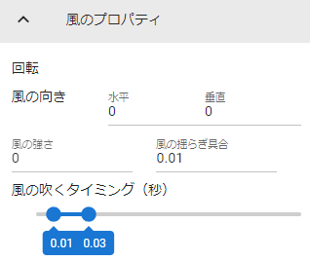

.. index:: Stage (property)

#####################################
Stage
#####################################

.. contents::

Main property
--------------------

.. image:: ../img/prop_stage_1.png
    :align: center

|

This is the main property of the Stage.

Type of stage Color: Change the texture of the floor.

.. csv-table::

    Default, the default floor represented by the grid.
    BasicSeaLevel, A general-purpose water level that can be finely adjusted. The water surface is animated. Reflects opacity.
    DayTimeWaterStage, the water surface. It represents the water surface during the day and the water surface is animated.
    NighttimeWaterStage, the water surface. It represents the water surface at night and the water surface is animated.
    DryGround, ground like dry ground.
    Desert, desert sand.
    Fields 1 to 4, other ground like general terrain.
    User, A floor that can be customized by the user, such as specifying a texture.

User stage only
    :Main texture:
        texture file
    :Normal map texture:
        normal map file
    :colour:
        texture base color
    :blending mode:
        Shader Mode
    :metallic:
        Metallic in shader
    :Glossy:
        Shader Glossiness
    :Luminous color:
        Shader Emission Color

About BasicSeaLevel, DayTimeWaterStage, and NighttimeWaterStage
    There are a wide variety of configuration options. See the Unity documentation for details.

    `<https://docs.unity3d.com/en/2019.1/Manual/HOWTO-Water.html>`_

|

.. index::
    Sky (Stage property)
    Sun

Sky property
-------------------

Sky settings. Single color, with sun, night can be set in detail.

.. |skydaytime| image:: ../img/prop_stage_2.png
.. |skynight| image:: ../img/prop_stage_3.png

.. csv-table::

    "for sky daytime", "for sky night blue, sky night purple"
    |skydaytime|, |skynight|

:Sky mode:
    Specify either ``Solid Color`` or ``Normal Empty``. ``Normal Sky`` will show the sun.
:Sky color:
    Change sky color.
:Sky shader:
    Choose from ``sky daitime``, ``sky night blue``, or ``sky night purple`` for ``normal sky`` . Also, the setting changes depending on the selection.

See the Unity documentation for details.

`<https://docs.unity3d.com/ja/2019.4/Manual/shader-skybox-procedural.html>`_

.. hint::
    Once you have a ``normal sky`` and the sun is visible, you can move the sun by rotating the lights.

|

.. index::
    Lighting (Stage property)
    Object shadow (Stage property)
    Halo
    flare

Lighting properties
-------------------

This is the lighting (Directional light) setting. Unlike Light, it is a system light, so it is treated as a property of Stage.

.. image:: ../img/prop_stage_4.png
    :align: center

:rotate:
    Specifies the angle at which light is emitted. It is easier to do this rotation with the operation handle.
:strength:
    Sets the intensity of light.
:Shadow strength:
    Sets the darkness of object shadows.

    .. hint::
        You can change where the shadows go by lighting and rotating the Light object.

:colour:
    Sets the color of the light.
:Halo:
    Adjusts the base value of the halo effect.

    .. warning::
        Halos have no effect on Stage lighting.

    .. note::
        This halo setting affects all light objects.
        The actual halo effect can be changed according to the color, strength, and range of the Light object.

:flare type:
    Select the type of light flare from ``None``, ``50mmZoom``, ``FlareSmall``, and ``Sun``.
:flare color:
    Specifies the flare color.
:flare brightness:
    Specifies the brightness of the flare.
:flare fade speed:
    Specifies the speed at which flares appear and disappear.

|

.. index:: Wind (Stage property)

Wind properties
--------------------

This is the wind (WindZone) setting.

:wind direction:
    The direction of the wind. Specify horizontal (X/Z direction) and vertical (Y direction) from 0 to 360 degrees.
:Wind strength:
    Specifies the strength of the wind applied to VRM, etc. 0 is off.
:How the wind fluctuates:
    A secondary strength that is randomly applied to the strength of the wind.
:When the wind blows:
    Makes the wind blow at intervals of seconds specified in this range.