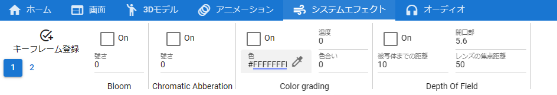
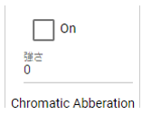
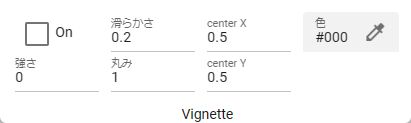

.. index:: SystemEffect(property)

#####################################
System effects
#####################################

.. |syseff2| image:: ../img/screen_ribbon_syseff2.png

.. csv-table::

    |syseff1|
    |syseff2|

|

This is a SystemEffect property. You can find this in the system effects tab of the ribbon bar. The values in the diagram are the default values.

.. index:: Bloom (SystemEffect property)

.. image:: ../img/prop_syseff_1.png
    :align: left

Bloom property.

:strength:
    Specify between 0 and 100.

|
|
|

.. index:: Chromatic Abberation (property of SystemEffect)

Chromatic Abberation property.

:strength:
    Specify between 0 and 1 in increments of 0.1.

|
|
|

.. index:: Color grading (SystemEffect property)

.. image:: ../img/prop_syseff_3.png
    :align: left

Color grading property.

:colour:
    Specifies the base color.
:temperature:
    Specify between -100 and 100.
:Tint:
    Specify between -100 and 100.

|
|
|

.. index:: Depth Of Field (SystemEffect property)

.. image:: ../img/prop_syseff_4.png
    :align: left

Depth Of Field property.

:Focus Distance:
    Specify between 0.1 and 50 in increments of 0.05. This is the direct distance of focus for Depth Of Field.
:Aperture:
    Specify between 0.1 and 32 in increments of 0.1.
:Focal Length of Lens:
    Specify between 1 and 50.

|
|
|

.. index:: Grain (property of SystemEffect)

.. image:: ../img/prop_syseff_5.png
    :align: left

Grain property.

:strength:
    Specify between 0 and 1 in increments of 0.1.
:size:
    Specify between 0.3 and 3 in increments of 0.1.

|
|
|

.. index:: Vignette (SystemEffect property)

Vignette property.

:strength:
    Specify between 0 and 1 in increments of 0.1.
:Smoothness:
    Specify between 0.1 and 1 in increments of 0.01. Adjusts whether to apply anti-aliasing to sharpen the edges where the Vignette effect is applied.
:Roundness:
    Specify between 0 and 1 in increments of 0.01. Adjusts the vignette effect from circular to square.
:center X:
    Specify between -3 and 5 in increments of 0.01. Adjusts the X coordinate of the center position of the Vignette effect.
:center Y:
    Specify between -3 and 5 in increments of 0.01. Adjusts the Y coordinate of the center position of the Vignette effect.

|
|
|

.. index:: Motion blur (SystemEffect property)

.. image:: ../img/prop_syseff_7.png
    :align: left

Motion blur properties.

:Shutter angle:
    Specify between 0 and 100.
:sample count:
    Specify between 4 and 32.