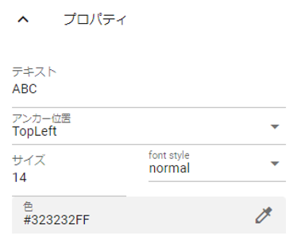

.. index:: Text (property)

#####################################
Text
#####################################

|

Set the 2D text to be displayed on the WebGL screen.

:text:
    Enter the string to display.
:Anchor position:
    Specifies the reference corner for movement and character string drawing.
:font size:
    Specifies the font size of the string.
:colour:
    Change the color of the string.
:Decoration:
    Specifies the character string decoration (bold, italic, or both).