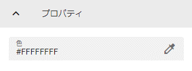

.. index:: UImage (property)

#####################################
UImage
#####################################

|

Set the 2D image to be displayed on the WebGL screen.

:colour:
    Change the base color of the image. (white is the base color)