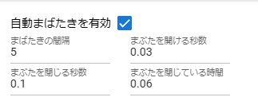
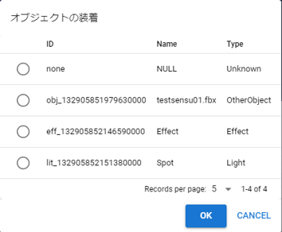

.. index:: VRoid/VRM (property)

#####################################
VRoid/VRM
#####################################

This is a property that can be used with VRoid/VRM.

.. contents::

.. index:: IK (VRM property)
.. index:: Movement mode (VRM property)
.. index:: Batch change of IK position (VRM property)
.. index:: Gravity setting (VRM property)
.. index:: IK marker assignment (VRM property)

IK, whole body
--------------------

|

Properties related to IK (mechanism for manipulating each part of the VRoid/VRM body).

:Movement mode:
    Switch to the mode that moves and rotates the entire VRoid/VRM at once. You can also move and rotate each IK part while this is enabled.
:Batch change of IK position:
    Displays a window that allows you to specify the position and rotation of IK parts in a spreadsheet format.
:Gravity settings:
    Set the gravity for the bones that VRM has as standard.
:IK marker assignment:
    Switch the VRM's IK markers to another object.

Assigning IK markers
    IK marker sites:
        Select the part of the IK marker to be switched.
    Assigned roles:
        Select which objects to assign as IK markers for the selected part.
    Reset:
        Reverts the IK markers back to their original markers.

|

.. index:: hand pose (VRM property)

Arm, Hand
----------------

.. image:: ../img/prop_vrm_2.png
    :align: center

|

**Right hand left hand:**

:combo box:
    Switch between manual operation, open, normal, goo, pointing, V sign, thumbs up, and grasp.
:slider:
    Specifies the degree of change of the pose specified in the combo box.

manual operation
^^^^^^^^^^^^^^^^^^^^^^^

Introduced from ver 1.0.4. You can edit the pose of the palm in detail by rotating each finger of the hand.

.. image:: ../img/prop_vrm_8.png
    :align: center

|

When ``manual operation`` is selected, the UI will be displayed. The finger UI mimics a real palm and fingers.

.. index:: blendshape (VRM property)

Blend shape
----------------------------

This is an item for finely adjusting the facial expressions of the VRoid/VRM.

.. image:: ../img/prop_vrm_4.png
    :align: center

|

VRoid/VRM has two types of blendshapes. The Unity meaning and how to capture it in this application are classified as follows.

======================= ============== ============== ================
Unity                   VRM version    This app(1.x)  This app(2.x)
----------------------- -------------- -------------- ----------------
SkinnedMeshRenderer     0.x/1.x        Generic         Dedicated
VRMBlendShapeProxy      0.x            Dedicated       Deprecated
VRM10RuntimeExpression  1.x            Dedicated       Common
======================= ============== ============== ================

The naming convention for the SkinnedMeshRenderer's blendshapes is roughly determined as follows. Please note that the actual number varies depending on the character.

===============  ==================================
Key               Description
---------------  ----------------------------------
~Fcl_All_~       Move all facial parts
~Fcl_BRW_~       Move eyebrows
~Fcl_EYE_~       Move your eyes
~Fcl_MTH_~       Move mouth
~Fcl_HA_~        Move teeth
~Other~          Move parts that do not apply to the above
===============  ==================================

.. note::
    * For VRM made by VRoidStudio.
    * For the sake of clarity, this application hides the prefixes of the original blendshapes all at once. note that.
    * In addition, I think that it is easy to find blendshapes in other apps if you use the above as a mark.

.. warning::
    Due to VRM 1.x specifications, Expression and BlendShape behave differently. See :ref:`blendshape_vrm` for details.

    With plain VRM1.x, the following BlendShapes tend not to work.

    * Emotions (Fcl_All, etc., eyebrows, eyes, and mouth all move)
    * mouth
    * etc

    * Since this application cannot determine which blend shape of which VRM is stuck, the function has been moved to the new method "Expression". (with original repairs)

|

.. index:: Auto blink (VRM property)

automatic blink
^^^^^^^^^^^^^^^^^^^^^

Make the VRoid/VRM facial expressions blink automatically.

    
|

:Enable Auto Blink:
    Toggles automatic blinking on and off. Default is on.
:Blink interval:
    Blink at intervals of this number of seconds.
:Seconds to open eyelids:
    Take this number of seconds to open your eyelids.
:Seconds to close the eyelids:
    Take this number of seconds to open your eyelids.
:Time when eyelids are closed:
    I'm closing my eyelids for this few seconds.

|

.. index:: Object attachment (VRM property)

wearing an object
--------------------

This is a list of functions that link different objects with the movement of each part of the VRoid/VRM.

.. image:: ../img/prop_vrm_5.png
    :align: center
    
|

You can attach objects to the following parts of your body. There is no limit to how many you can wear.

:combo box:
    Select the parts you want to equip.
:Equipment button:
    Shows the attach object dialog.
:Current equipment column:
    Unequip it with the delete button on the far right.

::

    Buttocks, left thigh, right thigh, left lower leg, right lower leg, left leg, right leg,
    spine, chest, neck, head,
    Left shoulder, right shoulder, left upper arm, right upper arm
    left forearm, right forearm, left hand, right hand, upper chest

:ID:
    ID of the object.

:Type:
    The type of object.

:Name:
    is the name of the object.

|
|
|
|
|
|
|

Select the object you want to equip and press the "OK" button to equip it.

|

Texture
----------------------

.. image:: ../img/prop_obj_1.png
    :align: center

|

This is a property related to textures owned by VRM. If there are multiple textures or materials, you can select them from the combo box. The number of textures that can be detected depends on the actual VRM.

:Material name:
    The name of the material held by the currently selected texture.
:shader:
    Switch the shader to Unity's Standard, VRM's VRM/MToon, or StandardAsset's Water (FX/Water4).

You can change the settings of the following shaders. For details, please refer to Unity Help.

:Standard:
    Color, Blend Mode, Metallic, Glossy, Emission Color, Texture
:VRM/MToon:
    Colors, Blending Modes, Culling Modes
    Metallic, Glossy, Emission Color, Shade Color
    Shading Toony, Rim Color, Rim fresnel power
    SrcBlend, DstBlend, Texture
:Water:
    Fresnel scale, reflection color, specular color, wave amplitude, wave frequency, wave steepness, wave velocity, wave direction AB, wave direction CD
:Sketch:
    Outline width, Stroke density, Add brightness, Multi brightness, Shadow brightness
:PostSketch:
    Outline width, Stroke density, Add brightness, Multiple brightness
:Comic:
    enableTexTransparent, Line width, Color, Tone threshold

.. hint::
    It is the same as setting the texture of OtherObject described later.

.. caution::
    Some shaders are not suitable for VRM. Please use with caution as it may change differently than expected.