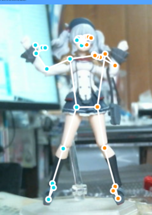

.. index:: MediaPipe (Posing)

######################################
Detect pauses with MediaPipe
######################################

.. contents::

MediaPipe is an AI solution for live and streaming media published by Google that can be used free of charge. This application uses the Pose function.

AI can automatically detect poses from images transferred by a webcam, etc., and apply them to VRoid/VRM.

https://google.github.io/mediapipe/

.. warning::
    * Because the IK positions of MediaPipe and this application do not match perfectly, pose detection is not 100%. Please note.

    * This function cannot be used except for VRoid/VRM.

1. Click MediaPipe on the 3D Models tab.

.. image:: posing_a.png
    :align: center

|

2. A confirmation message will be displayed. If there is no problem, press the OK button to proceed.

.. image:: posing_b.png
    :align: center

|

.. note::
    * Permission to use the camera is required for the first time, so please allow it before proceeding.

3. Depending on the specs of your PC, the rear camera image will be displayed while loading.

.. image:: posing_c.png
    :align: center

|

.. note::
    * If the app freezes in this state, please quit all of this app once and start it again.

.. sidebar::
    When a pose is detected...

    An approximate pose is drawn with points and lines.

    Because it is always detected in real time, the pose changes slightly every second.

    * This app does not have a function to save camera images as photos. The camera is used only for pose detection.

|

save the pose
====================

This is the normal procedure for obtaining a pose.

1. Click the blue button at the bottom right of the window.

.. image:: posing_e.png
    :align: center

|

* If you set the number of seconds for the timer to 1 or more, the timer will start after you press the button, and after that number of seconds the pose will be taken automatically.

2. Confirm that the pose has been reflected on the main screen of this app.

|

.. note::
    * Depending on the position, height, depth, etc. of the person or object being photographed, the pose actually reflected may differ from the assumption.

|

Always detect poses
======================

This is a function added from ver 2.0. The pose recognized by the webcam is **always reflected** on the currently selected VRM.

1. Click the red button in the lower right corner of the window.

.. image:: posing_e.png
    :align: center

|

2. Press the red button again to stop reflecting the pose.

.. note::
    Continues to reflect the recognized pose at intervals of about 1 second. If the webcam is no longer recognized for some reason, the reflection of the pose will also stop. In that case, please end this application once and start it again.

Switch video source
==========================

You can switch if you have multiple webcams connected or if you want to detect poses from photos.

1. Select the desired one from the video source combo box in the tool window.

:|imgsource|:
    |
    | * Or click the browse button

2. Confirm that the pose is detected from another camera/image.

.. image:: posing_h.png
    :align: center

|

| Due to the high performance of MediaPipe, it is possible to detect the human body and acquire poses not only from photographs but also from illustrations.
| Try using various images.

.. note::
    * In the case of illustrations and photos, the depth may not be fully reproduced. In that case, please modify each IK by operating VRM directly after saving the pose.

|

Save pose with timer
===============================

With the timer function, the camera image can be automatically shot after the specified time and the pose can be detected.

1. Specify the number of seconds in "Save timer" in the tool window.

.. figure:: posing_i.png
    :align: center

    Can be specified between 1 and 10 seconds

2. Press the Save Pose button.

.. figure:: posing_j.png
    :align: center

    A loading animation is displayed on the upper left, and after the specified number of seconds, a sound effect is emitted and the display disappears. (It turns red every second)

|

3. The pose will be saved according to the normal procedure, so please check and reflect it on the main screen.

|

Other functions
===============================

.. image:: posing_k.png
    :align: center

|

:Selfie Mode:
    Invert the image.
:Video source:
    Specify an image with the camera or browse button.
:Min Detection Confidence:
    Accuracy of detection
:Min Tracking Confidence:
    Tracking accuracy

* Check the `MediaPipe <https://google.github.io/mediapipe/>`_ site for other options.

**Close Menu**

1. Click |img_menubtn| on the top right of the menu.
2. The menu will disappear and you will see the detection preview in the background.

.. image:: posing_l.png
    :align: center

|