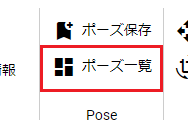
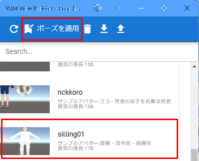

#####################################
Open VRoid/VRM poses
#####################################

The saved pose can be instantly reflected in any VRoid/VRM.

1. Click “Pose list” on the “3D model” tab.

|

2. A window with a list of poses will be displayed. Select the desired pose and click ``Apply Pose`` .

|

.. note::
    * The model character at the time of saving is written as a sample avatar. In addition, the height is also indicated as reference information.

3. Confirm that the pose has been reflected.

.. image:: posing_7.png
    :align: center

|

The same pose can be applied to other characters with different heights and builds. (However, if there is an extreme difference from the original character, it may deviate.)

When saving a pose, the position data of the VRoid/VRM itself is also saved. To restore that position data, please check "Also apply global coordinates when opening a pose" in the "Model" tab of "App Settings".

.. image:: posing_8.png
    :align: center

|

.. warning::
    * Even if it is a different character, it will be restored to the exact same position. If you load multiple characters, the positions will be duplicated, so please turn off the option if necessary.
    * In the case of poses that are extremely unbalanced, **it may not be reflected in a single application** (especially LowerLeg). In that case, apply it again and the pose will be perfectly reproduced.

.. hint::
    Another way to reproduce the pose is to drag and drop the .vvmpose file saved on your PC onto the WebGL screen.

    "In the case of this method, it is not necessary to register in the pose list." The target is limited to **VRM**, but you can immediately reproduce the pose by simply dragging it from Explorer etc.

|

Search pose
=======================================

Incremental search is possible in the same way as other lists in this application.

.. image:: posing_o.png
    :align: center

|

load pose file from disk
=======================================

You can load the pose file saved on your PC's disk into the app. Please push the upload button of the pose list.

.. image:: posing_9.png
    :align: center

|

| The target file is **.vvmpose** or **.json**.
| The extension "**.vvmpose**" unique to this application is only for ease of identification. Please attach.

When it finishes loading, it will be displayed in the list. (It doesn't matter if there is no thumbnail)

.. warning::
    | * If the data does not contain the necessary items, an error will occur when reading.
    | * Operation is not guaranteed if incorrect data is read.