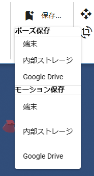

######################################
Save VRoid/VRM pose
######################################

Only for VRoid/VRM, you can save the state of moving the IK markers of the whole body in the app. This is per single pose, not an animation.

1. Make the VRoid/VRM pose.

.. image:: posing_1.png
    :align: center

|

2. Click “Save Pose” on the “3D Model” tab.

|

3. Select ``Device`` or ``Internal Storage``.

4. Enter the pose name.

.. image:: posing_3.png
    :align: center

|

The pose is saved immediately.

|

** Save/Do not save thumbnails **

Pose files support thumbnails. It doesn't affect the actual behavior at all, but it makes it easier to see in the list. To avoid saving, uncheck ``Save thumbnails when saving poses`` in the settings screen.

|

* For security purposes, it will always be cut when saving to a terminal. The thumbnail information is also cut when the pose file is read from the terminal.

.. hint::
    There is no need to register keyframes when saving poses.

.. admonition:: What is the saved pose data?

    In the case of internal storage, it is saved within the app (in the browser you are using). Since it is a place like a dedicated area for each application that is different from the folder on the local disk, it is not visible from other applications.

    In the case of a terminal, it will be saved in a folder on the PC as it is.

save to disk
=======================

After saving to the internal storage, you can save it back to your device. In that case, please press the download button.

.. image:: posing_4.png
    :align: center

|

:Save format:
    **.vvmpose**

.. note::
    The content is in JSON format. It is downloaded with a unique extension for easy identification.

|