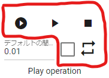
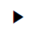
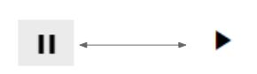
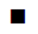
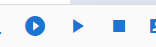
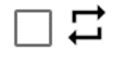

##########################################
Play and stop animation
##########################################

.. index:: play animation (animation project)

Play and stop animation
===============================

"This is the procedure for playing and pausing the animation." Use these buttons on the Animation tab of the Ribbon bar.

|

1. Use this button to play from the beginning.

|

|normalplay| Press this button to play from the middle.

2. Press this button to pause.

    Depending on the playback status of the pause button, the playback button and icon will switch from the middle.

3. Press this button to stop.

|

.. note::
    The same operation can be performed from the bar at the top of the timeline.
    |tlbarplay|

|

.. index:: loop animation (animation project)

Loop animation
===================================

This is the procedure to stop the animation. Use this button on the Animation tab of the Ribbon bar.

1. Check this to loop the animation.

|

2. Then press the play button from the beginning or the play button from the middle.

* Switching the check on/off during playback will not be reflected immediately. By stopping and playing from the beginning, the loop settings will be reflected correctly.