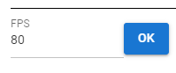
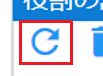

##########################################
Various animation settings
##########################################

.. contents::

.. index:: set number of frames and FPS (animation project)

.. _setfpsframe:

Set number of frames and FPS
-------------------------------

"Determine the length of the animation first." By default it is 60 and FPS is also 60. Please set two places of the figure in the ``Animation`` tab of the ribbon bar as you like.

.. |prop_right| image:: img/proper_1right.png

.. csv-table::
    :align: center

    |prop_left| , |prop_right|
    project settings screen, ribbon bar
    FPS (frames per second), maximum number of frames

|

* ``Frame`` indicated by FPS and ``Frame`` in this application are not the same. ``Frame`` in this application is just an array for data management.

.. warning::
    Changing FPS will recalculate ``FPS / 6000.0`` and automatically update the duration of all keyframes. Any manually set intervals will also change, so make sure you really want to change the FPS.

|

.. index:: set the default interval

.. _setdefaultduration:

Set default interval
---------------------------------

In an animation project, the interval between reaching the content of the frame is determined in seconds. By default, the calculation result of ``FPS / 6000.0`` is set.

You can change this to any number of seconds.

1. Enter the ``default spacing`` for the ribbon bar. (0.0001 to 99.9999 seconds)

.. image::img/proper_h.png
    :align: center

|

By specifying it here, subsequent keyframe registrations will be registered based on the number of seconds after the change.

If you register more than one frame apart, the frame interval will be the number of seconds adjusted based on the calculation result of ``default interval * number of frames apart``.

.. hint::
    If you want to set the interval for each keyframe, please refer to :doc:`animation_register` ... "Setting the keyframe interval" below.

.. index::
    Set WebGL screen size (animation project)
    window size
    WebGL screen size

Set WebGL screen size
---------------------------

　Set the screen size of WebGL as necessary. The default depends on the size of the window. Specify the screen size in the ``Screen`` tab of the ribbon bar.

.. image::img/proper_2.png
    :align: center

|

| If you specify a screen size that exceeds the window size of the current app, a scroll bar will be displayed.
| If you press the ``Original size`` button, the screen size will return to fit the window size.

Also, please note that if the ratio is different, the expected view from the main camera and Camera object will change when the screen size is changed.

.. admonition:: Relation between window size and WebGL screen size

    There are two meanings in this application: window size change and WebGL screen size change.

    :change window size:
        "This is a change to the app window itself." The width and height after subtracting the ribbon bar, left and right panels, and timeline panel will be the final size of the WebGL screen. If the WebGL screen size is the initial state of the app, the WebGL screen will automatically resize according to the window size.

    :WebGL screen size change:
        | The size can be changed regardless of the application window. Scrollbars will appear if the WebGL screen size is significantly larger. If you have changed the WebGL screen size manually even once, it will not change automatically even if you change the window size.
        | If you restore it to ``original size``, it will be automatically resized again.

|

.. index:: Navigation (animation settings)

navigation window
^^^^^^^^^^^^^^^^^^^^^^^^^^^^

It is troublesome to scroll when the screen size changes. If you use this in such a case, you can expect to improve operability because you can scroll while grasping the whole.

1. Press the ``Navigation`` button in the Screens tab of the ribbon bar.

.. image:: ../man5/img/general_scr02.png
    :align: center

|

2. A small navigation window will appear inside the main app window.

.. image:: ../img/screen_naviwin.png
    :align: center

|

3. A red frame is displayed as the currently displayed range on the navigation preview screen.
4. If the resolution of the WebGL screen is larger than the display area, clicking or dragging the red frame anywhere will scroll the WebGL screen accordingly.

.. hint::
    You can also ``Resize`` and ``Reset Camera`` from within the navigation window.

|

.. index:: assign cast to role (animation project)

.. _settingcast2role:

Assign Cast to Role
--------------------------------

An animation project has a timeline for each role. Roles are usually assigned automatically when loading a cast (avatar object). Here's how to assign a cast to a specific role.

By assigning a cast to a role, the animation data on the role can be played with that cast.

Timing when casts (avatars/objects) and roles are linked
    * When loading a new VRoid/VRM or each object
    * When changed later on the role setting screen
    * When opening a saved project

|

Assign Casts to Roles Later
^^^^^^^^^^^^^^^^^^^^^^^^^^^^^^^^^^^^^^

    As a case, you want to replace an animation that has been registered once with a cast of the same type that is read later.

    1. Click ``Settings`` from the ``Animation`` tab of the ribbon bar.

    .. image::img/proper_3.png
        :align: center

    |

    2. Open the ``Manage Roles`` tab.

    .. image::img/proper_4.png
        :align: center

    |

    1. Click the row of the role you want to assign the cast to.

    .. image::img/proper_5.png
        :align: center

    |

    4. A pop-up dialog will open, select the desired cast and press the SET button.

    .. image::img/proper_6.png
        :align: center

    |

    ..note::
        Select ``None`` to make the role uncast.

    5. Observe that the cast is automatically unassigned from its original role.

    .. image::img/proper_7.png
        :align: center

    |

    * The display will also switch on the animation timeline.

    .. figure:: img/proper_8.png
        :align: center

        **Top:** Timeline for later assigned roles

        **Bottom:** Timeline of the original role

    |

    Cast unassigned roles and timelines remain intact and are not deleted.

|

.. index:: delete role (animation project)

Delete role
--------------------

| Delete the role. Delete roles that are no longer needed in your animation project. This operation also removes the actual object that is the cast assigned to the role.
| To delete only the cast (object), right-click the object list and delete it.

1. Click ``Settings`` from the ``Animation`` tab of the ribbon bar.

.. image::img/proper_3.png
    :align: center

|

2. Open the ``Manage Roles`` tab.
3. Check the radio button to the left of the role you want to remove, and click ``Remove Role`` on the toolbar.

.. figure::img/proper_9.png
    :align: center

|

4. A confirmation message will be displayed, so press the OK button.

.. warning::
    * Deleting a role like this deletes both the role and the cast(object).
    * Stages cannot be deleted.

* The same thing can be done by right-clicking on the object list and selecting ``Delete both this object and role``.

.. image:: img/proper_a.png
    :align: center

|

.. index:: delete all timelines (animation project)

Delete empty timelines all at once
----------------------------------------

If you repeatedly assign casts (objects) to roles, there may be a relatively large number of timelines (roles) with no objects assigned or no keyframes registered.

1. Click ``Settings`` on the ``Animation`` tab of the ribbon bar.

2. Click ``Delete Empty Timeline`` on the toolbar.

.. image:: img/proper_e.png
    :align: center

|

3. A confirmation message will be displayed, so press the OK button.

|

Timelines that meet the following conditions are deleted here.

    1. No keyframes are registered
    2. Object is not assigned to timeline (role)

.. warning::
    * SystemEffect, BGM, SE, Stage cannot be separated from roles, so they are not included.

|

.. index:: change role title (animation project)

Change role title
------------------------------------

You can enter a title for the role for clarity. It is usually set as an initial value as follows.

:VRM:
    VRM meta information title

:Non-VRM:
    Sequential number by type name + date and time

| Because of this specification, roles and casts are automatically assigned if the VRM title is the same as the role title.
| When changed, the VRM will not be automatically assigned, but it can be managed with an easy-to-understand role name in the animation project.

1. Click ``Settings`` from the ``Animation`` tab of the ribbon bar.

.. image:: img/proper_3.png
    :align: center

|

2. Open the ``Manage Roles`` tab.

.. image:: img/proper_b.png
    :align: center

|

3. Find the row where you want to edit the role title and click on the role.

.. image:: img/proper_c.png
    :align: center

|

4. A pop-up dialog will appear. Enter a new name and press the SET button.

.. image:: img/proper_d.png
    :align: center

|

Confirming the entry also changes the role title display on the timeline.

|

.. index:: reload role (animation project)

reload all roles
------------------------------------

HTML and Unity's WebGL are not always perfectly linked. If there is a discrepancy between the role data and display on the HTML side and WebGL side, the display is updated by reloading.

1. Click ``Settings`` on the ``Animation`` tab of the ribbon bar.

.. image:: img/proper_3.png
    :align: center

|

2. Open the ``Manage Roles`` tab.
3. Click ``Refresh`` on the toolbar.

|