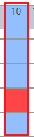
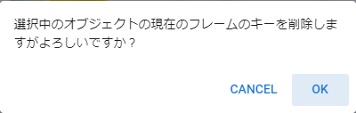
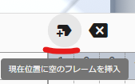

.. index:: registering and setting keyframes (animation project)

##########################################
Registering and setting keyframes
##########################################

.. contents::

.. index::
    Select Frames (Animation Project)
    Restoring keyframes

choose a frame
===============================

This is the frame selection operation, which is the basic operation. There are two types of selection.

:Select frame number:
    Choosing a frame position
:Select line in timeline:
    Select timeline (role)

Choosing a frame position
^^^^^^^^^^^^^^^^^^^^^^^^^^^^^^^^^^

1. Click on the frame number at the top of the timeline to select it.

.. image::img/register_1.png
    :align: center

|

2. If a keyframe has already been registered at that position, the settings will be restored to the UI and the object will be restored to that state.

* If the keyframe is not registered, it will not be selected even if you click the keyframe part.

Select timeline (role)
^^^^^^^^^^^^^^^^^^^^^^^^^^^^^^^^

1. Click on the role name on the left of the timeline to select it.

.. image::img/register_c.png
    :align: center

|

You can also select the timeline by selecting the object list.

.. image::img/register_d.png
    :align: center

|

* However, only when the corresponding object is associated with a role

2. The settings for that object are restored to the UI.

If a keyframe has been registered
^^^^^^^^^^^^^^^^^^^^^^^^^^^^^^^^^^^^^^^^^^^^^^

1. Clicking a point with a registered keyframe selects both the frame position and the timeline (roll).

|

.. _reg_anim:

.. index::
    Registering and updating keyframes
    Keyframe registration window (animation)

Registering/updating to a keyframe
=====================================

We will register keyframes on the timeline. The contents that can be registered in key frames are as follows.

:Contents that can be registered:
    * All operations of VRoid/VRM implemented in this application
    * All other object actions
    * Manipulate system effects and audio
    * FBX animation, effect animation

.. note::
    * Material management such as texture files is not included in animation. Please load each file corresponding to the material name used in each object in advance.
    * Animations of commonly used 3D objects such as FBX can be played individually in the animation project of this application.
    * From ``ver 2.1.0``, you can also register system effects and audio from the buttons in the keyframe registration window. (The registration button in each tab of the ribbon bar has been abolished.)

.. admonition:: Is it possible to register keyframes for each bone (IK marker)?

    * It is not possible to register only specific bones like MMD. All IK parts must be registered for each frame. (In other words, save the current pose/state as a whole)

    From ``ver 2.1.0``, it is now possible to check the bones to be registered (called IK markers in this application) on the UI. In the future, we plan to make it possible to register keyframes for each bone in the same way as MMD/MMM.

1. Click the keyframe number on the VRoid/VRM timeline to pose.

.. image::img/register_1.png
    :align: center

|

.. warning::
    Please note that if the keyframe has already been registered, that pose will be read and the current pose will be overwritten.

2. Pose the VRoid/VRM and each object.

.. image::img/register_2.png
    :align: center

|

3. Click ``Register Keyframe`` in the ``Animation`` tab of the ribbon bar.

.. image::img/register_3.png
    :align: center

|

1. The ``keyframe registration window`` will appear.

.. |keyframe1| image:: ../img/screen_ribbon_animation_keyframe1.png
.. |keyframe2| image:: ../img/screen_ribbon_animation_keyframe2.png

In the keyframe registration window, you can see what you are about to register and the bones.

.. csv-table::
    :header-rows: 1

    VRM, non-VRM
    |keyframe1|, |keyframe2|
    All IK markers including IKParent, IKParent only

.. hint::
    You can display it by right-clicking anywhere in the ribbon bar (Control-click or double-tap on macOS).

.. index:: Contents to be registered in the keyframe

Decide what to register
    In ``What to register``, you can choose the following contents.

    .. csv-table::
    
        Common (move), only register the movement of the IK marker. The ``position`` of the ``common`` tab in the property list.
        Register common (other than movement), IK marker rotation, magnification, jump, and shake. It is the item with the same name on the ``Common`` tab of the property list.
        Property, Register each property of the currently selected object. A non-common tab in the property list.

    * Up to ``ver 2.0.3``, all three types were forcibly registered.
    * In ``ver 2.1.0`` or later, for example, if you change the blend shape in the first frame and want to continue to reflect that blend shape, you can uncheck the property and register it in the second frame and later. , you can leave it all the way to a keyframe that changes the property again. You can only need to modify the blendshape on frame 1 and then change again.
    * There is no point in turning on or off the check for system effects and audio.

.. |vvmico_ikparent| image:: img/vvmico_bn_ikparent.png
.. |vvmico_head| image:: img/vvmico_bn_head.png
.. |vvmico_eye| image:: img/vvmico_bn_eyeviewhandle.png

.. |vvmico_chest| image:: img/vvmico_bn_chest.png
.. |vvmico_aim| image:: img/vvmico_bn_aim.png

.. |vvmico_rightsho| image:: img/vvmico_bn_rightshoulder.png
.. |vvmico_rightla| image:: img/vvmico_bn_rightlowerarm.png
.. |vvmico_righthand| image:: img/vvmico_bn_righthand.png
.. |vvmico_leftsho| image:: img/vvmico_bn_leftshoulder.png
.. |vvmico_leftla| image:: img/vvmico_bn_leftlowerarm.png
.. |vvmico_lefthand| image:: img/vvmico_bn_lefthand.png
.. |vvmico_rightll| image:: img/vvmico_bn_rightlowerleg.png
.. |vvmico_rightft| image:: img/vvmico_bn_rightleg.png
.. |vvmico_leftll| image:: img/vvmico_bn_leftlowerleg.png

Check the IK marker to be registered
    In ``Bones to register``, you can check the IK markers that are actually registered. Note that the number of IK markers that can be checked differs between VRM and other objects.

    :VRM:
        .. csv-table::

            |vvmico_prop| property, |vvmico_ikparent| IKParent, |vvmico_head| Head, |vvmico_eye| EyeViewHandle, |vvmico_lookat| LookAt
            |vvmico_chest| Chest, |vvmico_aim| Aim, |vvmico_pelvis| Pelvis, |vvmico_leftsho| LeftShoulder, |vvmico_rightsho| RightShoulder
            |vvmico_leftla| LeftLowerArm, |vvmico_lefthand| LeftHand, |vvmico_rightla| RightLowerArm, |vvmico_righthand| RightHand,
            |vvmico_leftll| LeftLowerLeg, |vvmico_leftft| LeftLeg, |vvmico_rightll| RightLowerLeg, |vvmico_rightft| RightLeg,
    
    :Non-VRM:
        .. csv-table::

            |vvmico_ikparent| IKParent, |vvmico_prop| properties

    In addition, it is also expressed so that the parts can be identified with icons. This icon is also used in the keyframe content popup on the timeline.

    .. image:: ../img/screen_timeline02.png
        :align: center

.. |allregister| image:: img/register_4.png
.. |contextregister| image:: img/register_5.png

|

..
    Register all objects at once
        |allregist| 　If you want to register the current poses and states of all objects, click ``Register all objects``.

Right click to register
    |contextregister| Right-clicking on the object list and clicking ``Register Pose in Current Frame`` has the same function.

6. Confirm that the target keyframe in the timeline is filled.

|

    .. note::
        * Numbers are displayed for keyframes with common properties such as movement and rotation.
        * The number increases when a child key described later is registered.
        * Numbers are not displayed for keyframes that do not have common properties registered.

7. Select another keyframe, give it another pose and register again.

.. image:: img/register_7.png
    :align: center

|

Repeat for the length of the animation you want to create.

.. index:: compensation between keyframes

.. admonition:: What about the compensation between keyframes?

    Due to the effects of the library used by this application, the animation between registered keyframes is automatically corrected. (Some motions cannot be fully corrected)

    When you click on a frame number that has nothing registered, if it is between the registered keyframes, the pose in the middle of the animation will be reproduced. This will change depending on the easing and spacing described later.

.. index::
    Delete keyframe
    Delete keyframe properties only

Delete keyframe
==========================

The registered keyframes on the timeline are deleted.

1. Click to select the object you want to delete and the keyframe number.

|

2. Click ``Remove Keyframe`` in the ``Animation`` tab of the ribbon bar.

|

3. Select and click the deletion method.

    .. csv-table::
        :align: center

        Delete keyframe, deletes the keyframe itself as usual.
        Delete only properties, deletes each property of ``non-common`` objects from the contents registered in the keyframe. Keyframes are not deleted.

4. A confirmation message will be displayed. If there is no problem, press the OK button.

|

.. index::
    Change keyframe position
    Target multiple keyframes

Change the registered keyframe position
===========================================

　You can move the frame position of the registered keyframe.

1. Register a keyframe.

2. Double-click the registered keyframe part.

    Make sure that the frame number is correctly selected for the keyframe at this time.

|

3. Enter the new position value in the input box of the destination frame and press the button with the move icon.

.. image:: img/register_b.png
    :align: center

|

.. note::
    * If you change it, the display of keyframes on the timeline will also change immediately.
    * If a keyframe has already been registered at the frame position of the change destination, the button cannot be pressed.

.. hint::
    By specifying the start frame and end frame in a specific range, you can move multiple keyframes at once.

    example
        | Positions where keyframes exist = 10, 13, 14
        | Current start frame = 10
        | Current end frame = 15
        | Destination frame = 20

        | After moving = 20, 23, 24

|

.. index:: modifiable properties

Modifiable properties
==============================

The properties that can be changed in the keyframe settings dialog are as follows. Any property can be changed many times at once by targeting multiple keyframes. I think there are many ways to use it.

If you hover the mouse cursor over the registered key position, a popup will appear and you can check the interval and easing at that position.

|

.. index:: set easing

Set easing
^^^^^^^^^^^^^^^^^^^^^^

It can be set after registering the keyframe. If you're familiar with animation, you may already know this, but it's a factor that affects how things move, such as how long it takes to change to a certain keyframe, and how fast it moves. Changing this will change the animation from a monotonous impression to a lively one.

1. Register the keyframe.

2. Double-click the registered keyframe part to open the keyframe window.

    Make sure that the frame number is correctly selected for the keyframe at this time.

3. Select the type of easing you like from the easing combo box.

.. image:: img/register_e.png
    :align: center

|

.. hint::
    By specifying the start frame and end frame, you can change the easing settings for multiple keyframes at once.

    .. image:: img/register_h.png
        :align: center

* For easing, refer to the following site.

`Easing Function Cheat Sheet <https://easings.net/en>`_

|

.. index:: set keyframe interval

.. _modifyeachduration:

Set keyframe intervals
^^^^^^^^^^^^^^^^^^^^^^^^^^^^^^^^^^

　It can be set after registering the keyframe. Sets the time to reach the corresponding keyframe. Basically it is calculated automatically, but you can also specify it manually.

::

    Default duration: [FPS / 6000] seconds

1. Register a keyframe.

2. Double-click the registered keyframe to open the keyframe window.

    Make sure that the frame number is correctly selected for the keyframe at this time.

3. Specify the number of seconds in the Duration field.

.. image::img/register_f.png
    :align: center

|

With this, you can create motion at any time for each timeline (roll) without registering keyframes according to the actual frame numbers.

.. caution::
    However, if you do not properly manage the duration yourself, it may be difficult to determine the motion timing for each timeline and cause confusion. please note.

.. hint::
    By specifying the start frame and end frame, you can change the settings for multiple keyframe intervals at once.

    .. image:: img/register_h.png
        :align: center

|

.. index:: copy interval from other avatar's timeline

Copy intervals from another avatar's timeline
^^^^^^^^^^^^^^^^^^^^^^^^^^^^^^^^^^^^^^^^^^^^^^^^^^

You can easily obtain the total interval from a specific range of keyframes on other timelines.

.. image:: img/register_g.png
    :align: center

1. Select the timeline (role name) you want to copy.
2. Enter the ``start`` and ``end`` frame numbers.
3. When you press the copy button, the total value of the interval in the specified range will be reflected in the duration input box.
4. If you really want to apply it, use the ** key to erase fractions in the duration input box. The changes will be confirmed**.

..note::
    When you press the copy button, the total value of the interval is set in the input box.

    If you want to **cancel** the input, please do not press **keys in the input box and switch the selection of the timeline**. Doing so cancels the changes and allows you to move on to another timeline or avatar editing.

|

.. index:: change position and rotation

Change position or rotation
^^^^^^^^^^^^^^^^^^^^^^^^^^^^^^^^^^^^

It can be set after registering the keyframe. If the selected avatar is VRM, OtherObject, Camera, Light, or Effect, you can adjust the position and rotation of the object itself.

1. Fill in the input fields for the X, Y and Z axes of position or rotation.
2. By default, changes are applied to target keyframes with relative position and relative angle.

:Position: Moves the object plus or minus from its current position. If 0, do not change.
:Rotate: Rotate the object plus or minus from the current angle. Possible values are in the range -180 to +180 degrees. If 0, do not change.

.. note::
    If you check ``absolute specification``, you can specify absolute.
    However, it can easily overwrite the position and rotation in existing keyframes, so be careful when targeting multiple keyframes.

.. hint::
    By specifying the start frame and end frame, you can change the position and rotation of objects in multiple keyframes at once.

    .. image:: img/register_h.png
        :align: center

|

.. index:: insert an empty frame at the current position

Insert an empty frame at the current position
===============================================

Inserts an empty frame at the currently selected frame number and shifts all frames to the right by one.

1. Press the button for this icon.
2. Then, all frames to the right, including the currently selected frame position, will shift to the right by one, and the maximum number of frames will increase by one.

.. index:: remove current frame position

Delete current frame position
===============================================

Deletes the currently selected frame position.

.. image:: img/register_j.png
    :align: center

1. Press the button for this icon.
2. The currently selected frame position is deleted, all right frames are shifted left by one, and the maximum number of frames is reduced by one.

.. warning::
    If keyframes have been registered on each timeline at the target frame position, those keyframes will also be deleted.

|

.. index::
    cut keyframe
    Copy keyframe
    paste keyframe

Cut/copy/paste keyframes
================================================

You can copy, cut, paste, and move registered keyframes.

.. image:: img/register_m.png
    :align: center

1. Press these buttons on the ``Animation`` tab of the ribbon bar.

**Copy and Paste**

1. Press the Copy button.
2. Select any frame number and press the Paste button.

|

**Cut and Paste**

1. Press the cut button.
2. Select any frame number and press the Paste button.

.. note::
    In either case, if pasted to a frame that already has a keyframe registered, the contents will be overwritten.

.. caution::
    The destination timeline (role) must be the same.

    * Even if the object type is the same, it cannot be pasted if the roles are different.

Child key function
====================

Added from ``ver 2.1.0``. Child key is a function to register multiple motion keyframes to one keyframe. This makes the movement of objects such as VRMs smoother even with fewer keyframes.

Child keys can be operated from the timeline panel toolbar.

|

.. caution::
    Only movement of IK markers is memorized for child keys. There is only one rotation etc. per IK marker per keyframe.

    **Key Flow**

    .. image:: img/register_n0.png
        :align: center
        :alt: flowchart

|

Register child key
^^^^^^^^^^^^^^^^^^^^^^

1. Pose the selected object as normal.
2. Set the value of the input box |childkey2| in the Timeline panel toolbar to **-1**.
3. Press |childkey1| to register a child key.

.. caution::
    Registered child keys can be modified, but they cannot be replaced later like normal keyframes. If you want to replace the child keys, you need to delete them once and register them.

|

modify child key
^^^^^^^^^^^^^^^^^^^^^^

You can edit a child key that has been registered once.

1. Select the target object and target keyframe.
2. Select the index of the child key you want to modify from the input box |childkey2| on the timeline panel toolbar.
3. Press |childkey1| after correcting the pose.

.. caution::
    The input box for the child key looks like this:

    :-1: Select/restore the entire child key of the keyframe. Select this if you want to add a child key.
    :0～n: Select/restore the pose of the specified child key. Select these when modifying or deleting.

delete child key
^^^^^^^^^^^^^^^^^^^^^^^^

Deletes the specified child key. The keyframes themselves are not yet deleted.

1. Select the target object and target keyframe.
2. Select the index of the child key you want to delete from the input box |childkey2| on the timeline panel toolbar.
3. Press |childkey3| after correcting the pose.

.. caution::
    You cannot delete even if you select **-1** in the input box.